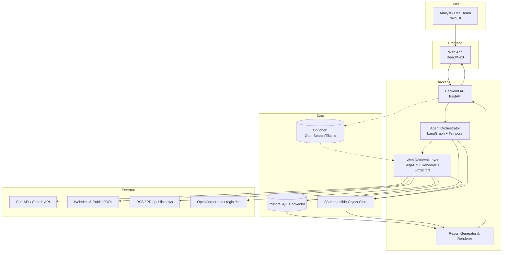
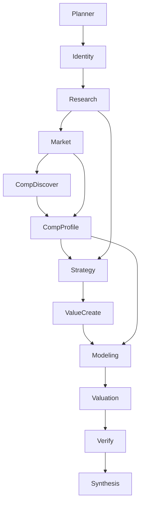
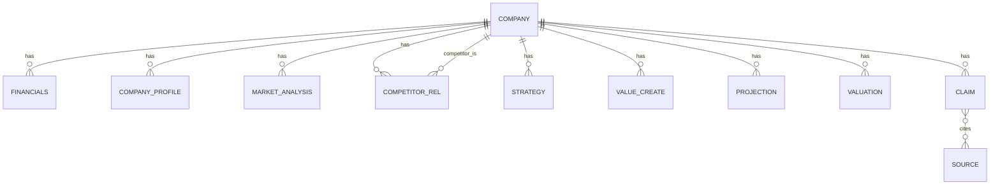

# 1. High-Level System Architecture

## Diagram (Mermaid)




### Components

- **UI:** interactive report viewer/editor (competitors, assumptions, version history)
- **Backend API:** authentication, project/run lifecycle, report retrieval, editing actions
- **Orchestrator:** coordinates agent graph with durability, retries, timeouts
- **Retrieval layer:** search, fetch, render, extract, de-duplicate, cache
- **Storage:** Postgres as source-of-truth; pgvector for semantic retrieval cache; object store for raw artifacts
- **Optional search index:** OpenSearch for full-text search across extracted content (add when scale demands)

---

# 2. Agent System Architecture

## Agent diagram




## Agents

### Planner Agent

- **Responsibilities:** build task graph (nodes, deps), set thresholds (confidence, sources), timeout/retry policy
- **Inputs:** company_id, name, orgnr, internal financial snapshot
- **Outputs:** Plan (task graph), orchestration parameters
- **Dependencies:** none
- **Failure handling:** fallback to a minimal sequential plan; log and continue

### Identity (Entity Resolution) Agent

- **Responsibilities:** canonicalize company identity (aliases, domains, key URLs)
- **Inputs:** name, orgnr
- **Outputs:** `canonical_company` object + alias list + confidence
- **Dependencies:** Planner
- **Failure handling:** if confidence low, pause pipeline and raise “requires human selection”

### Research Agent

- **Responsibilities:** company overview + key facts (products, channels, geographies, ownership hints)
- **Inputs:** canonical company, internal financials, retrieval APIs
- **Outputs:** `company_profile` + sources + confidence
- **Dependencies:** Identity
- **Failure handling:** degrade to “short profile” from fewer sources; mark missing fields; keep provenance

### Market Analysis Agent

- **Responsibilities:** industry classification, TAM, growth, trends, segmentation
- **Inputs:** company_profile, retrieval
- **Outputs:** `market_analysis` + sources + confidence
- **Dependencies:** Research
- **Failure handling:** if market size/growth unavailable, output “unknown” + flags; proceed to competitors with only industry keywords

### Competitor Discovery Agent

- **Responsibilities:** discover competitor candidates; rank by similarity
- **Inputs:** company_profile, market_analysis
- **Outputs:** competitor candidate list + evidence + scores
- **Dependencies:** Market Analysis
- **Failure handling:** if discovery weak, return candidates anyway with low confidence and request human review

### Competitor Profiling Agent (parallel per competitor)

- **Responsibilities:** normalize competitor info & metrics (ranges when necessary)
- **Inputs:** competitor candidate record
- **Outputs:** standardized competitor profile + sources + confidence
- **Dependencies:** Competitor Discovery
- **Failure handling:** timebox; if too slow, emit placeholder and proceed (keeps pipeline moving)

### Strategy Agent

- **Responsibilities:** non-generic SWOT/moat + channel dynamics + barrier analysis
- **Inputs:** company_profile, market_analysis, competitor profiles
- **Outputs:** `strategy` object (SWOT + thesis hooks)
- **Dependencies:** Research + Market + Competition
- **Failure handling:** produce SWOT with explicit “confidence per bullet” and unknown sections flagged

### Value Creation Agent

- **Responsibilities:** convert strategy into initiatives; quantify as driver assumptions
- **Inputs:** strategy, internal financials
- **Outputs:** `value_creation_plan` (initiatives, impact ranges, dependencies)
- **Dependencies:** Strategy
- **Failure handling:** if quantification impossible, output qualitative initiatives + “not modelled”

### Financial Modeling Agent (code-first)

- **Responsibilities:** deterministic 7-year projections, scenarios, ratios
- **Inputs:** internal financials, value creation drivers, competitor benchmarks
- **Outputs:** projections (Base/Downside/Upside)
- **Dependencies:** Value Creation + Competitor profiling
- **Failure handling:** if data insufficient, widen ranges, reduce confidence, or fall back to “simple growth x margin rule” documented in output

### Valuation Agent

- **Responsibilities:** EV range, peer multiple range, sensitivity
- **Inputs:** projections, benchmarks
- **Outputs:** valuation object
- **Dependencies:** Modeling
- **Failure handling:** if multiples cannot be derived, use industry default bands with explicit “low confidence” + disclosure

### Verification / Fact-check Agent

- **Responsibilities:** validate claims against sources; confidence scoring; block unsupported claims
- **Inputs:** all objects + references
- **Outputs:** validation report (supported/unsupported/flagged lists)
- **Dependencies:** full pipeline
- **Failure handling:** if verification fails or sources missing, block report synthesis and return actionable error + list of unresolved claims

### Report Synthesis Agent

- **Responsibilities:** convert structured output into report JSON with blocks + charts + references
- **Inputs:** structured objects + validation report
- **Outputs:** versioned report JSON
- **Dependencies:** Verify
- **Failure handling:** refuse narrative inclusion for unsupported claims; do not hallucinate; output “data missing” placeholders

## Agent memory / communication / delegation

- **Memory:** no “chat memory”; use **per-company run state** stored in Postgres as strongly typed objects + references. Agents read/write via the orchestrator (or limited direct DB access by worker services).
- **Communication:** objects persisted in DB; any “messages” are plan nodes and status updates. Avoid agents passing raw text; pass structured JSON.
- **Delegation:** Planner creates tasks; orchestrator dispatches tasks to workers. Research agents cannot spawn arbitrary tasks without planner approval—keeps graph predictable.

---

# 3. Agent Orchestration Model

## Recommended model: LangGraph + Temporal

- **LangGraph**: agent graph modeling, explicit state machine, makes dependencies and tool-calling logic transparent.
- **Temporal**: durable workflow execution, retries/backoff, cancellation, visibility, and idempotency for long-running tasks.

### Why this combo

- 50–100 companies + web search + rendering => long-running + failure-prone.
- Need to restart from mid-stage without losing state.
- Need per-stage timeouts and per-stage retries with backoff.

### Pipeline mode

- **Hierarchical planning** + **graph execution**
- Partial parallelization: competitor profiling parallel, some synthesis can start after minimal prerequisites

---

# 4. Data Architecture

## Data model (entities)

- Company
- CompanyProfile
- MarketAnalysis
- Competitor (subject→competitor relation + competitor entity)
- StrategyInsight
- ValueCreationInitiative
- FinancialProjection
- Valuation
- Source (raw artifact + extracted text)
- Claim (link between structured outputs and sources; verification status)

## Schema example (short)




### Data flow between agents

- Agents consume previous agents’ structured objects.
- Each agent emits:
  - structured output
  - references (source_ids)
  - confidence scores
- Report synthesis is a transformation over structured objects, not a free-text summary.

---

# 5. Database Architecture

## Technologies

- **PostgreSQL**: system of record for structured objects and run state
- **pgvector**: semantic retrieval cache (for snippets/evidence extraction)
- **S3-compatible object store**: raw HTML snapshots, PDFs, OCR outputs, screenshots
- **OpenSearch/Elastic (later)**: fast full-text search across sources and claims (optional)
- **Neo4j (later, optional)**: only if competitor/product/relationship queries become core; otherwise store relationships in Postgres with normalized tables

### When each is required

- Postgres: always
- pgvector: required once you do RAG-style verification and chunk retrieval
- OpenSearch: add when you need user-facing search across evidence or want fast discovery across large corpus
- Neo4j: avoid early; add only if you need rich graph analytics beyond what Postgres can do efficiently

---

# 6. Web Research Infrastructure

## Public sources only: how to make it robust

### Components

- Search wrapper (SerpAPI)
- Renderer (Playwright/browserless) for JS sites
- HTML/PDF fetcher + canonicalization
- Extractors:
  - company description
  - product lines
  - geography hints
  - revenue/employee counts (ranges with uncertainty)
  - market/industry keywords

### Query strategies

- Start with deterministic patterns:
  - `"${canonical_name}" site:se` (for Swedish sources)
  - `"${canonical_name}" "AB"` (if applicable)
  - industry keywords from known category
- Use operator constraints:
  - `site:` restrictions
  - language restrictions (Swedish/English)
- Limit per-agent queries; use cache keyed by query+plan node.

### Multi-source verification

- Always store:
  - URL
  - publisher
  - published_date
  - snippet text
  - extracted fields
- Require at least 2 sources for key numeric claims or label low-confidence.

### Information extraction

- Prefer “rules + schema + LLM”:
  - extract fields deterministically where possible (regex, heuristics)
  - use LLM for synthesis and for disambiguation (e.g., market categorization), but always with references

---

# 7. Source Verification System

## Fact-check pipeline

1. **Ingestion**
  - store raw HTML/PDF in object store
  - store extracted text in Postgres
2. **Claim generation**
  - when agents emit structured outputs, also emit associated claims with source lists
3. **Verification agent**
  - validate each claim:
    - existence of supporting span in sources
    - agreement between sources
    - recency & credibility
4. **Confidence scoring**
  - derived from source credibility and agreement
5. **Block/allow**
  - unsupported claims block synthesis or are excluded from narrative
  - “missing data” is acceptable; hallucinated data is not

## Integration

- Verification runs after modeling/valuation to ensure final report doesn’t include unverified numbers.
- The report references the verified sources per claim.

---

# 8. Report Generation System

## Requirements implementation

- **Interactive web reports:** React/Next renders report JSON into sections
- **Expandable references:** each paragraph uses `refs: [source_id]`; UI fetches source metadata
- **Editable competitor lists:** user edits competitor relations -> backend triggers incremental recompute
- **Dynamic updates:** dependency graph recompute; only rerun affected tasks

## Templating & rendering

- Templating engine:
  - Jinja2-like backend templates for narrative blocks
  - structured objects as inputs
- Rendering engine:
  - Chart generation in backend (Matplotlib) stored as SVG/PNG in object store
  - Report JSON stored versioned in Postgres, with a pointer to artifacts

---

# 9. Infrastructure Architecture

## Deployment layout

- **API servers:** FastAPI behind load balancer
- **Agent workers:** worker pool running LangGraph tasks and retrieval tasks
- **Queue:** Redis-based (RQ/Celery) or Temporal task queue
- **Databases:** Postgres + pgvector, replicated for read scaling
- **Object store:** cloud buckets or MinIO
- **Search systems:** optional OpenSearch cluster later
- **Containers:** Dockerized services
- **Orchestration:** Kubernetes for scaling and rollout

## Scalability considerations

- Rate limit external APIs
- Strict caching policy to reduce SerpAPI calls
- Parallel competitor profiling with concurrency controls (avoid overwhelming search/render)
- Horizontal scaling of workers as corpus grows
- Observability:
  - Temporal UI
  - metrics (Prometheus/Grafana)
  - logs (OpenSearch)

---

# 10. Cursor-Based Development Workflow

## Repository structure (Cursor-friendly)

```
/nivo
  /apps
    /api
      main.py
      routes/
      deps/
    /workers
      orchestrator/      # LangGraph graphs
      tasks/             # per agent runner
    /frontend
      (React/Next)
/packages
  /domain               # Pydantic schemas, enums
  /retrieval            # SerpAPI wrapper, playwright, extractors
  /agents               # agent prompt templates + structured IO contracts
  /modeling             # deterministic projection engine (python)
  /valuation            # valuation methods
  /verification         # claim validation + scoring
  /reporting            # report templates + chart generation
/docs
  agent_prompts.md
  system_design.md
  decision_log.md
```

## How to use Cursor agents effectively

- Let Cursor generate:
  - boilerplate FastAPI routes
  - Pydantic models
  - LangGraph node wiring
  - unit tests for extractors and modeling
- Force Cursor to obey:
  - schema contracts
  - deterministic outputs
  - logging and idempotency
- Avoid Cursor producing:
  - opaque chain-of-thought
  - free-text agents with no schema
  - business logic hidden in prompts

---

# 11. Implementation Milestones

## Phase 1 — Core backend infrastructure

- Postgres schema + pgvector
- S3 storage
- FastAPI skeleton
- run state model + versioning

## Phase 2 — Agent orchestration

- LangGraph agent graph
- Temporal workflow or RQ/Celery as interim
- plan/run lifecycle endpoints

## Phase 3 — Retrieval layer

- SerpAPI integration
- Playwright renderer
- caching + dedupe + extraction

## Phase 4 — Research agents

- Identity + Research + Market
- competitor discovery (longlist/shortlist)

## Phase 5 — Competition agents

- parallel competitor profiling
- confidence scoring; evidence linking

## Phase 6 — Strategy & value creation

- strategy agent with non-generic SWOT
- value creation plan with drivers

## Phase 7 — Financial modeling & valuation

- deterministic projection engine
- scenario generation
- valuation agent
- integration tests

## Phase 8 — Verification & report synthesis

- claim-level verification
- report JSON generation
- charts + references

## Phase 9 — UI integration

- report viewer/editor
- competitor editing
- version history
- incremental recompute UX

Dependencies: each phase depends on previous structured objects (Identity → Research → Market → Competition → Strategy → Modeling → Valuation → Report), with orchestration/retrieval core required before scaling.

---

# 12. Cost & Scalability Analysis

### Assumptions (public-only sources)

- Companies: 50–100
- Agents: 8–12 nodes per company
- Heavy costs: web search/render + LLM synthesis/verification

### Cost drivers

- **Web search:** SerpAPI calls per company (Research/Market/Competitor discovery)
- **Rendering:** Playwright fetches for JS sites; expensive if overused
- **LLM:** synthesis, strategy, verification (token-heavy)

### Optimization strategies

- **Cache aggressively**:
  - dedupe queries
  - cache extracted fields per URL
  - store canonical sources per company for reuse
- **Time-box tasks**:
  - competitor profiling has strict timeouts
- **Reduce LLM usage**:
  - run extraction via rules where possible (regex, heuristics)
  - use smaller models for classification tasks (industry tags, confidence estimation)
- **Parallelize carefully**:
  - parallel competitor profiling but cap concurrency and rate limit
- **Selective depth**:
  - for low-potential companies, run a shorter pipeline; only do deep report after a screening stage

---

