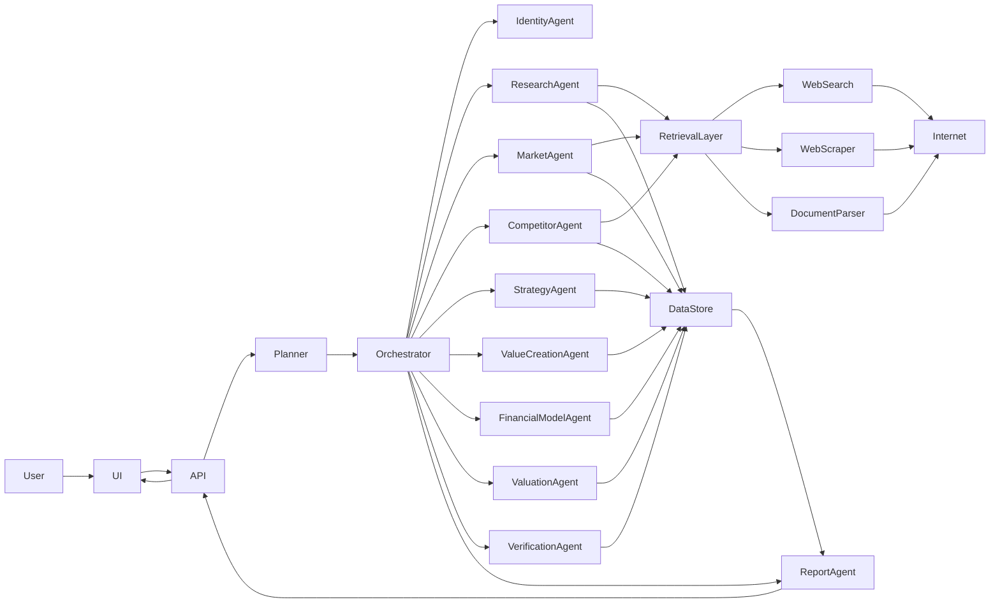
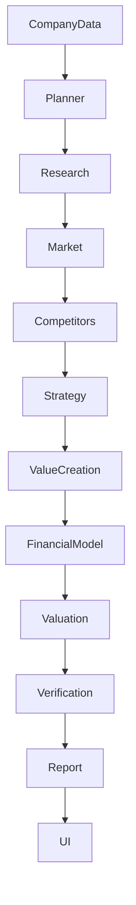
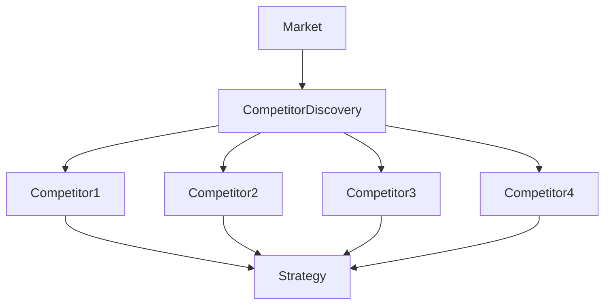

Below is the **complete agent system architecture diagram and explanation** for the Nivo platform.

# Nivo Agent System Architecture

## High-Level System




---

# Layered Architecture

## Layer 1 — User Layer

```
Analyst
   ↓
Web UI
```

Capabilities:

- run analysis
- review report
- edit competitors
- adjust assumptions
- rerun agents

---

# Layer 2 — API Layer

```
FastAPI Backend
```

Responsibilities:

```
POST /analysis/run
GET /analysis/{company}
POST /analysis/update
```

Manages:

- authentication
- run state
- version history
- triggering pipelines

---

# Layer 3 — Agent Orchestration Layer

Core engine controlling agents.

```
Planner Agent
↓
Task Graph
↓
LangGraph Execution
↓
Worker Pool
```

Responsibilities:

- task scheduling
- retries
- partial recompute
- dependency tracking

---

# Layer 4 — Agent Layer

This is the **core intelligence layer**.

## Planner Agent

Creates task graph.

Example:

```
Company Profiling
Market Research
Competitor Discovery
Competitor Profiling
Strategy Analysis
Value Creation
Financial Modeling
Valuation
Verification
Report Generation
```

---

# Research Agents

## Identity Agent

Resolves:

```
company name
org number
domains
aliases
```

Prevents incorrect entity data.

---

## Company Profiling Agent

Collects:

```
company history
products
geography
business model
ownership
```

Outputs:

```
Company_Profile
```

---

## Market Research Agent

Finds:

```
industry
market size
growth
trends
segments
```

Outputs:

```
Market_Analysis
```

---

## Competitor Discovery Agent

Finds competitors.

Outputs:

```
Competitor_List
```

---

## Competitor Profiling Agent

Runs **in parallel**.

Profiles competitors.

Outputs:

```
Competitor_Profile
```

---

# Strategy Agents

## Strategic Analysis Agent

Produces:

```
SWOT
moat analysis
competitive advantages
```

---

## Value Creation Agent

Converts strategy into initiatives.

Example:

```
international expansion
ecommerce
product portfolio expansion
procurement optimization
```

These match the **value creation logic described in the architecture document** .

---

# Financial Agents

## Financial Modeling Agent

Builds projections.

```
Revenue
EBITDA
Cash flow
```

7-year model.

---

## Valuation Agent

Calculates enterprise value.

Methods:

```
EBITDA multiples
peer comparisons
sensitivity analysis
```

---

# Verification Agent

Critical for **preventing hallucinations**.

Validates:

```
claims
numbers
sources
```

Rules:

```
multi-source verification
source credibility
claim confidence
```

---

# Report Agent

Compiles final report.

Structure follows **investment memo format** seen in the example report :

```
Executive Summary
Company Overview
Market Analysis
Competitive Landscape
Value Creation Plan
Financial Projections
Valuation
```

Output:

```
report.json
charts
references
```

---

# Retrieval Layer

Handles web data gathering.

```
Search API
Web scraping
Document parsing
```

Services:

```
SerpAPI
Playwright
HTML parsers
PDF parsers
```

---

# Data Layer

Central data storage.

```
PostgreSQL
pgvector
object storage
```

Stores:

```
company data
agent outputs
sources
claims
reports
```

---

# Object Storage

Stores raw artifacts:

```
HTML
PDF
images
charts
```

---

# Vector Storage

Used for:

```
semantic search
source retrieval
verification
```

Example:

```
pgvector
```

---

# Data Flow Diagram




---

# Parallel Processing Model

Certain agents can run **in parallel**.




This dramatically speeds up analysis.

---

# Failure Handling

Agent failure must **not crash pipeline**.

Examples:

```
Competitor discovery fails
→ continue with reduced list
```

```
Market size unavailable
→ continue with qualitative analysis
```

Each agent returns:

```
confidence score
error state
source coverage
```

---

# Human-in-the-Loop Design

Humans intervene only when necessary.

Examples:

```
low-confidence market analysis
ambiguous competitors
missing projections
```

UI features:

```
edit competitor list
edit assumptions
rerun agent
```

---

# Final System Capability

The system described can:

```
analyze 100 companies
produce investment-level analysis
automate 80% of research
```

Matching the goal defined in your architecture document .

---

# Next Step (Highly Recommended)

The **next thing you should build is the system's central brain**:

```
LangGraph Agent Orchestrator
```

This is the component that:

```
manages task graphs
handles retries
handles agent communication
stores run state
```

Without a proper orchestrator most agent systems **collapse into spaghetti pipelines**.