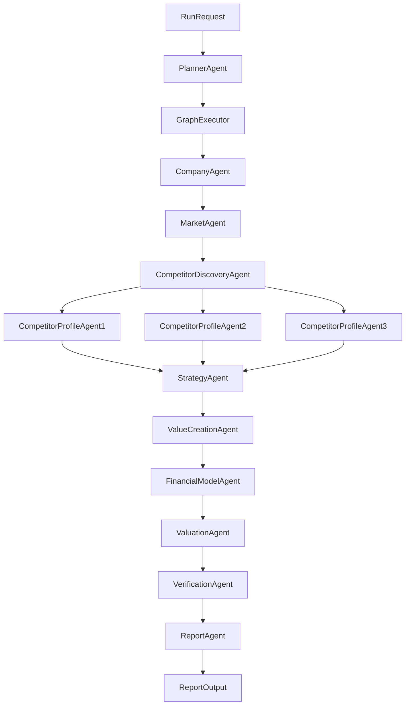
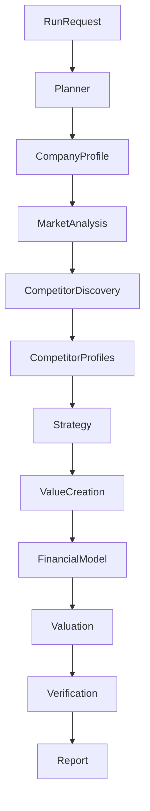

Below is the **LangGraph Orchestrator Specification** for the Nivo platform.
This is the **core control system** of your entire agent architecture.

Without a proper orchestrator, agent systems quickly become unmanageable.
This design ensures:

* deterministic runs
* recoverable workflows
* partial recompute
* structured agent communication

It directly implements the sequential research pipeline described in the Nivo architecture document (company → market → competition → strategy → value creation → projections → valuation → report). 

---

# langgraph-agent-orchestrator.md

## Purpose

This document defines the **LangGraph orchestration system** for the Nivo automated company analysis platform.

The orchestrator coordinates all agents responsible for generating investment-style analysis reports similar to the reference investment memo structure. 

---

# Core Responsibilities

The orchestrator must:

```
coordinate agents
track workflow state
manage retries
handle failures
persist outputs
support partial recompute
```

---

# System Architecture



---

# Orchestrator Components

## Planner Agent

Creates the execution plan.

### Input

```
company_id
financial_snapshot
analysis_scope
```

### Output

```
Plan:
 nodes
 dependencies
 retry_rules
 timeouts
```

Example:

```
company_profile
market_analysis
competitor_discovery
competitor_profiles
strategy
value_creation
financial_model
valuation
verification
report_generation
```

---

# LangGraph State Schema

All agents read/write a shared **state object**.

```python
class AnalysisState(TypedDict):

    company_id: str
    run_id: str

    company_profile: Optional[dict]
    market_analysis: Optional[dict]

    competitors: Optional[list]
    competitor_profiles: Optional[list]

    strategy: Optional[dict]
    value_creation: Optional[dict]

    financial_model: Optional[dict]
    valuation: Optional[dict]

    verification: Optional[dict]

    report: Optional[dict]

    errors: list
```

---

# Node Definitions

Each node represents an **agent execution step**.

---

# Company Profiling Node

### Agent

Company Profiling Agent

### Input

```
company_id
org_number
```

### Output

```
company_profile
```

### Writes

```
state.company_profile
```

---

# Market Analysis Node

### Input

```
state.company_profile
```

### Output

```
market_analysis
```

### Writes

```
state.market_analysis
```

---

# Competitor Discovery Node

### Input

```
state.company_profile
state.market_analysis
```

### Output

```
competitors[]
```

### Writes

```
state.competitors
```

---

# Competitor Profiling Node

Runs **parallel nodes**.

### Input

```
competitor
```

### Output

```
competitor_profile
```

### Writes

```
state.competitor_profiles
```

---

# Strategy Node

### Input

```
company_profile
market_analysis
competitor_profiles
```

### Output

```
strategy
```

---

# Value Creation Node

### Input

```
strategy
financials
```

### Output

```
value_creation
```

---

# Financial Modeling Node

### Input

```
value_creation
historical_financials
```

### Output

```
financial_model
```

---

# Valuation Node

### Input

```
financial_model
competitor_profiles
```

### Output

```
valuation
```

---

# Verification Node

Validates claims.

### Input

```
all_outputs
sources
```

### Output

```
verification_report
```

---

# Report Generation Node

### Input

```
all_outputs
```

### Output

```
report
```

---

# LangGraph Execution Graph

```python
workflow = StateGraph(AnalysisState)

workflow.add_node("company_profile", company_profile_agent)
workflow.add_node("market_analysis", market_agent)
workflow.add_node("competitor_discovery", competitor_discovery_agent)
workflow.add_node("competitor_profiles", competitor_profile_agent)
workflow.add_node("strategy", strategy_agent)
workflow.add_node("value_creation", value_creation_agent)
workflow.add_node("financial_model", financial_model_agent)
workflow.add_node("valuation", valuation_agent)
workflow.add_node("verification", verification_agent)
workflow.add_node("report", report_agent)

workflow.set_entry_point("company_profile")

workflow.add_edge("company_profile", "market_analysis")
workflow.add_edge("market_analysis", "competitor_discovery")
workflow.add_edge("competitor_discovery", "competitor_profiles")
workflow.add_edge("competitor_profiles", "strategy")
workflow.add_edge("strategy", "value_creation")
workflow.add_edge("value_creation", "financial_model")
workflow.add_edge("financial_model", "valuation")
workflow.add_edge("valuation", "verification")
workflow.add_edge("verification", "report")
```

---

# Parallel Execution

Competitor profiling runs concurrently.

Example:

```
competitor_profiles = parallel_map(
    profile_competitor,
    competitors
)
```

---

# Failure Handling

Each node must return:

```
result
confidence
errors
sources
```

Example failure:

```
Market size not found
```

System behavior:

```
continue pipeline
flag low confidence
```

---

# Retry Strategy

Retry rules per node:

```
max_retries: 3
retry_backoff: exponential
timeout: 120s
```

---

# Partial Recompute

Users may update:

```
competitors
assumptions
financial drivers
```

Orchestrator must recompute only affected nodes.

Example:

```
competitor changed
→ rerun competitor_profiles
→ rerun strategy
→ rerun value_creation
→ rerun financial_model
→ rerun valuation
```

---

# Persistence

After each node execution:

```
save state snapshot
save agent output
save sources
```

Database tables:

```
runs
agent_outputs
sources
reports
```

---

# API Integration

Trigger run:

```
POST /analysis/run
```

Response:

```
run_id
status
```

Check progress:

```
GET /analysis/run/{run_id}
```

Fetch report:

```
GET /analysis/{company_id}
```

---

# Observability

Track:

```
agent runtime
search queries
LLM usage
confidence scores
```

---

# Cost Control

Limits:

```
max search queries per company
max pages scraped
max LLM tokens
```

---

# Security

Ensure:

```
URL validation
HTML sanitization
rate limiting
```

---

# Final Orchestrator Flow



---

# Final Capability

The orchestrator enables Nivo to:

```
analyze 50–100 companies
automatically generate deep research
produce investment-grade reports
```

Matching the platform goal described in the architecture document. 

---

