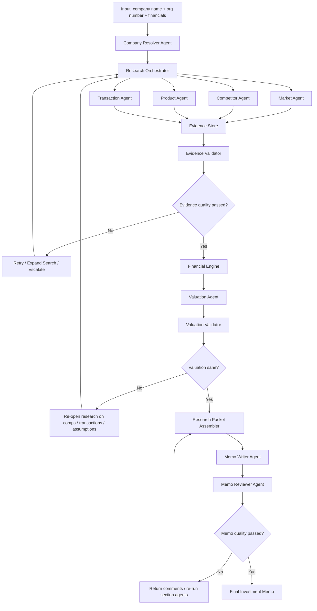
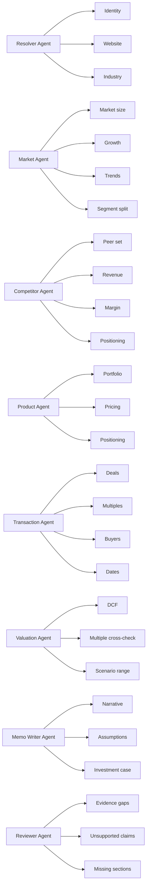
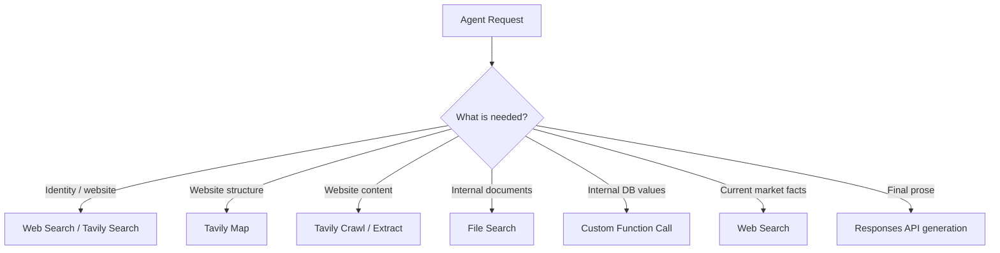
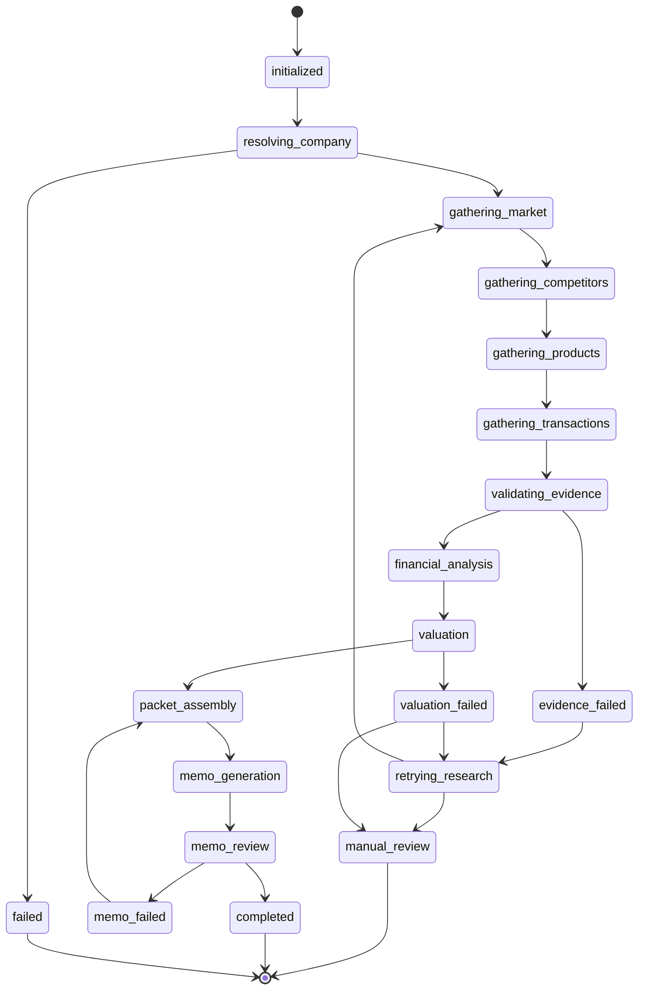
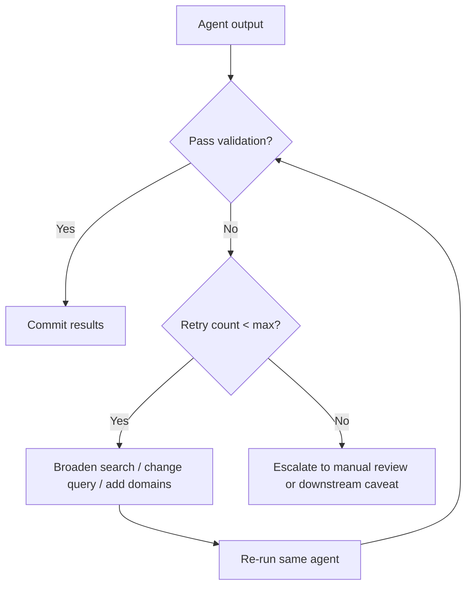
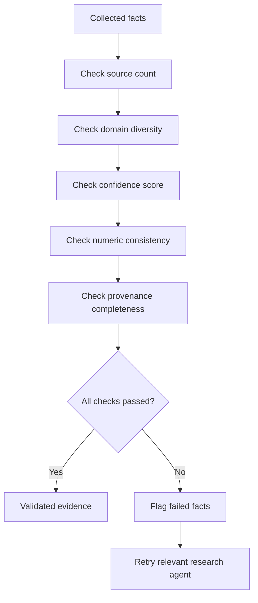
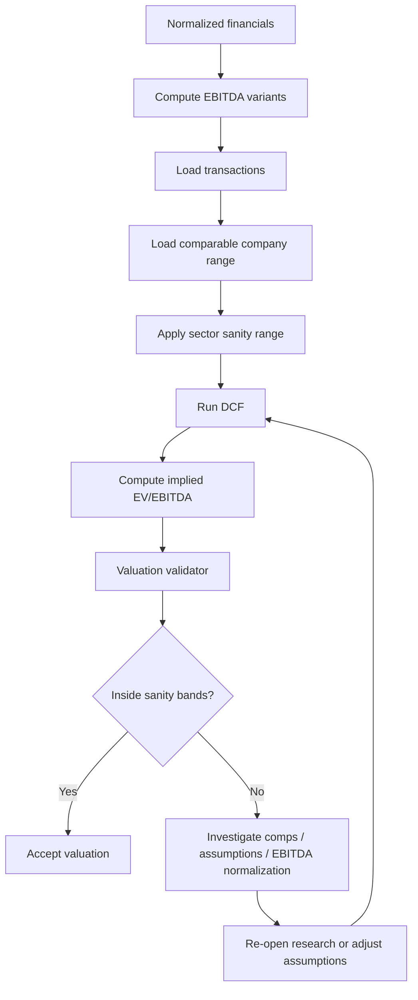
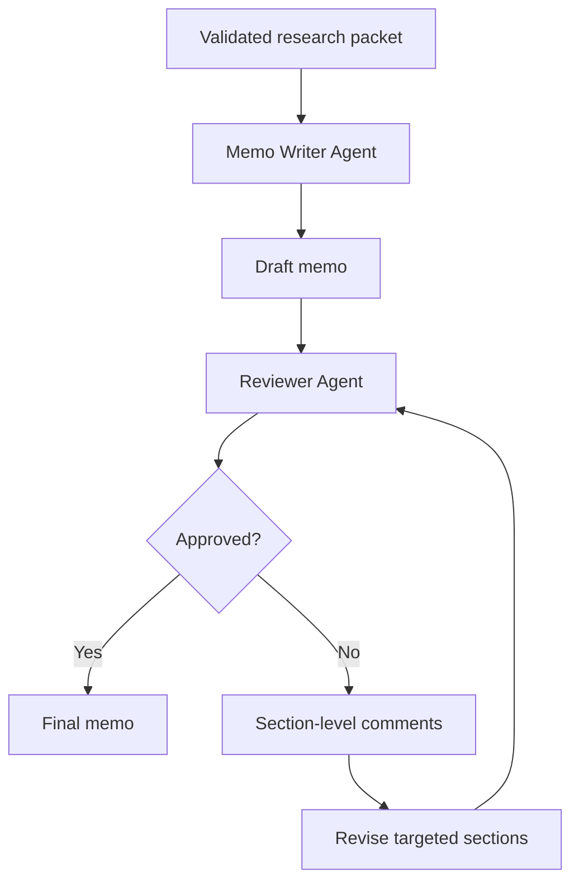

# AGENT_WORKFLOW_DIAGRAMS.md

## Purpose

This document provides workflow diagrams, orchestration logic, state transitions, retry loops, and JSON schema references for the Nivo deep research system built on the OpenAI Responses API and Agents SDK.

It is intended to accelerate implementation by giving Cursor a concrete blueprint for:

- agent sequencing
- tool usage
- state management
- retry and escalation behavior
- validation checkpoints
- final memo generation flow

---

# 1. End-to-End System Diagram



---

# 2. Agent Ownership Diagram



---

# 3. Tool Usage Flow



---

# 4. Research Run State Machine



---

# 5. Retry Logic Diagram



Recommended retry policy:

- resolver agent: max 2 retries
- market agent: max 2 retries
- competitor agent: max 2 retries
- transaction agent: max 3 retries
- memo writer: max 1 rewrite
- reviewer loop: max 2 cycles

---

# 6. Evidence Validation Flow



Validation gates:

- minimum 2 independent sources for important external facts
- confidence score >= configured threshold
- numeric disagreement inside tolerance band
- every claim carries source metadata

---

# 7. Valuation Control Flow



Sanity checks:

- EV to equity bridge
- net debt sign correctness
- implied EV/EBITDA in plausible range
- terminal value dominance warning
- scenario outputs consistent with directionality

---

# 8. Memo Generation Flow



Writer should never invent unsupported figures.
Reviewer should explicitly mark:

- unsupported
- inferred
- validated
- requires DD confirmation

---

# 9. Orchestrator Pseudocode

```python
def run_deep_research(company_name: str, org_number: str, financials: dict):
    state = init_state(company_name, org_number, financials)

    state.company_profile = resolver_agent.run(state)

    for agent in [market_agent, competitor_agent, product_agent, transaction_agent]:
        state = run_with_retry(agent, state)

    validation = evidence_validator.run(state)
    if not validation.passed:
        state = retry_failed_research(state, validation)

    state.financial_packet = financial_engine.run(state)
    state.valuation_packet = valuation_agent.run(state)

    valuation_check = valuation_validator.run(state)
    if not valuation_check.passed:
        state = retry_valuation_research(state, valuation_check)

    state.research_packet = assemble_packet(state)
    state.memo_draft = memo_writer.run(state)

    review = memo_reviewer.run(state)
    if not review.passed:
        state.memo_draft = memo_writer.revise(state, review.comments)

    return state.memo_draft
```

---

# 10. Suggested Run State Object

```json
{
  "run_id": "uuid",
  "company_name": "string",
  "org_number": "string",
  "company_profile": {},
  "market_facts": [],
  "competitors": [],
  "product_facts": [],
  "transactions": [],
  "evidence_validation": {},
  "financial_packet": {},
  "valuation_packet": {},
  "research_packet": {},
  "memo_draft": "",
  "review_comments": [],
  "status": "initialized|running|retrying|manual_review|completed|failed"
}
```

---

# 11. Example JSON Schemas Per Agent

## CompanyProfile

```json
{
  "company_name": "Example AB",
  "org_number": "556123-4567",
  "website": "https://example.se",
  "industry": "Premium furniture",
  "description": "Designer and manufacturer of premium furniture",
  "headquarters": "Sweden",
  "confidence_score": 0.88,
  "sources": [
    {
      "url": "https://example.se",
      "title": "Official website"
    }
  ]
}
```

## MarketFact

```json
{
  "fact_type": "market_size",
  "value": "SEK 270bn",
  "region": "Europe",
  "confidence_score": 0.74,
  "source_count": 3,
  "sources": [
    {
      "url": "https://source1.com",
      "title": "Market report"
    }
  ]
}
```

## CompetitorRecord

```json
{
  "name": "Peer Co",
  "revenue_msek": 420,
  "ebitda_margin_pct": 11.5,
  "segment": "Premium furniture",
  "geography": "Nordics",
  "positioning": "Design-led"
}
```

## TransactionRecord

```json
{
  "target": "Peer Co",
  "buyer": "Strategic Buyer",
  "year": 2024,
  "ev_msek": 580,
  "ebitda_msek": 96,
  "ev_ebitda": 6.0,
  "source_url": "https://example.com/deal"
}
```

## ValuationPacket

```json
{
  "primary_method": "precedent_transactions",
  "ev_low_msek": 420,
  "ev_base_msek": 470,
  "ev_high_msek": 530,
  "implied_ev_ebitda": 5.9,
  "sector_range_low": 4.1,
  "sector_range_high": 8.0,
  "lint_passed": true,
  "warnings": []
}
```

---

# 12. Handoff Rules

Handoffs should occur only when upstream outputs meet minimum thresholds.

Examples:

- Resolver Agent → Research Agents only if identity confidence >= 0.8
- Research Agents → Evidence Validator only if at least one result exists
- Evidence Validator → Valuation only if critical market / comp / transaction facts meet threshold
- Memo Writer → Reviewer only after research packet is complete

If thresholds fail, the orchestrator should either:
- retry,
- widen search,
- or mark section as incomplete with explicit caveat

---

# 13. Search Expansion Strategy

If first-pass research fails:

## Resolver Agent
- add org number to query
- constrain to official / known domains
- search language variants

## Market Agent
- broaden from niche market to adjacent market
- search geography-specific variants
- use segment keywords

## Competitor Agent
- search by product category
- search by customer type
- search by geography

## Transaction Agent
- widen date range
- search synonyms for M&A / acquisition / sale
- search industry subsegments

---

# 14. Manual Review Triggers

The run should pause or mark output as limited when any of the following occur:

- no verified website found
- company identity confidence below threshold
- market section has fewer than 2 acceptable external sources
- competitor set has fewer than 3 plausible peers
- no transaction data found and DCF produces outlier multiple
- evidence validator fails after max retries
- reviewer detects unsupported critical claims

---

# 15. Folder / Documentation Suggestion

```text
docs/
  deep_research/
    AGENTIC_RESEARCH_ARCHITECTURE.md
    AGENT_PROMPTS.md
    DATABASE_SCHEMA.md
    IMPLEMENTATION_TASKS.md
    AGENT_WORKFLOW_DIAGRAMS.md
```

---

# 16. Implementation Priority

Recommended order:

1. Add run state object
2. Add research fact storage
3. Implement resolver agent
4. Implement market / competitor / transaction agents
5. Add evidence validator
6. Add valuation validator
7. Add research packet assembler
8. Add memo writer
9. Add reviewer loop
10. Add traces and monitoring

---

# 17. Summary

These diagrams define the operating model for the Nivo deep research system.

The core principle is:

- research first
- validate second
- value third
- write last

That is the main shift required to move from a report generator to an investment-grade research workflow.
