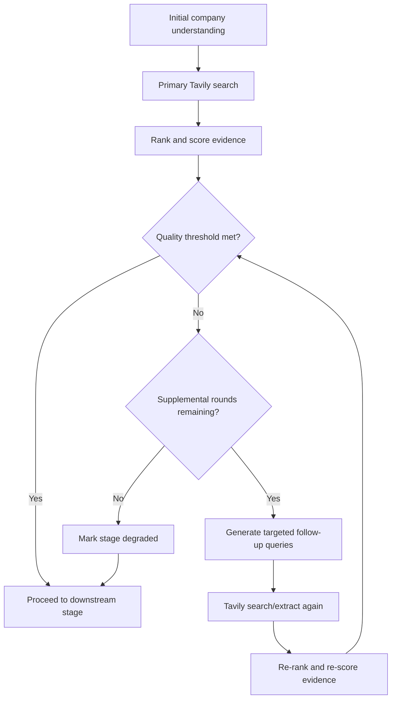

# BOUNDED_RETRIEVAL_LOOP_SPEC.md

## Purpose

This document defines the bounded retrieval loop for the Nivo Deep Research system.

The goal is to allow the system to perform additional Tavily-powered evidence discovery when the first retrieval pass is too weak, while preventing:
- infinite research loops
- runaway query cost
- uncontrolled crawling
- weak evidence being treated as sufficient

This loop should improve evidence quality without turning Deep Research into an open-ended autonomous crawler.

---

# 1. Core Principle

The retrieval loop is:

**bounded, scored, inspectable, and degradable**

That means:
- every retrieval round has a budget
- every round is scored
- every extra round is triggered by explicit conditions
- if evidence is still weak after the allowed rounds, the stage degrades explicitly

The system must not keep searching indefinitely.

---

# 2. Where the Loop Applies

The bounded retrieval loop should apply only to stages where public evidence quality matters materially.

## Primary stages
- company understanding support
- market analysis
- competitor discovery

## Optional later stages
- valuation support
- trend/news enrichment

Do not use the bounded retrieval loop for:
- identity resolution against internal DB truth
- financial calculations
- claim verification logic
- report composition

---

# 3. High-Level Flow



---

# 4. Trigger Conditions for Supplemental Retrieval

A supplemental retrieval round may run only if one or more of the following are true:

## 4.1 Market evidence too weak
Examples:
- too few high-quality market sources
- no usable market growth range
- only low-trust blog-like sources found
- niche still ambiguous

## 4.2 Competitor evidence too weak
Examples:
- too few real competitors discovered
- competitor set is too generic
- no benchmark-quality evidence found
- only poor-quality comparison sources found

## 4.3 Company understanding still too thin
Examples:
- business model still unclear
- products/services still vague
- market niche not stable enough to drive better search queries

## 4.4 Contradictory low-quality evidence dominates
Examples:
- inconsistent market labels from low-quality sources
- conflicting competitor lists from weak sources
- contradictory extracted snippets without a strong source anchor

---

# 5. Hard Limits

These are the default hard stops.

## Default limits
- `max_primary_search_rounds = 1`
- `max_supplemental_rounds = 2`
- `max_total_queries_per_stage = 6`
- `max_total_extracted_urls_per_stage = 10`
- `max_total_mapped_domains_per_stage = 2`
- `max_total_crawled_domains_per_stage = 1`
- `max_crawl_depth = 1` (or 2 only when explicitly approved)
- `max_total_retrieval_time_per_stage_seconds = 90`

## Interpretation
This means a stage can:
- do one initial retrieval round
- do up to two follow-up rounds
- then it must either proceed or degrade

No stage should keep searching beyond the configured bounds.

---

# 6. Quality Thresholds

Supplemental retrieval should be driven by quality thresholds, not by vague intuition.

## 6.1 Company understanding threshold
Minimum suggested conditions:
- business model present
- products/services present
- geography present
- market niche hypothesis present
- confidence >= configured threshold

## 6.2 Market analysis evidence threshold
Suggested score dimensions:
- source trust
- relevance
- recency
- niche specificity
- extraction quality

Example:
- `market_evidence_quality_threshold = 0.70`

## 6.3 Competitor evidence threshold
Suggested score dimensions:
- competitor relevance
- source trust
- overlap with company niche
- evidence count
- benchmark usefulness

Example:
- `competitor_evidence_quality_threshold = 0.65`

## 6.4 Stop condition
If the score crosses the threshold:
- stop retrieval
- proceed to next stage

If the score does not cross threshold after max rounds:
- explicitly degrade the stage
- continue only if policy allows

---

# 7. Query Strategy by Round

## Round 1 — Broad but targeted
Use company understanding to generate:
- primary market queries
- primary competitor queries
- high-trust domain-targeted queries where relevant

Example:
- "professional workwear market growth Europe"
- "hospitality uniforms market size Nordics"

## Round 2 — Gap-filling
Use missing evidence analysis to generate:
- more niche-specific queries
- trade association queries
- supplier/manufacturer queries
- alternate wording queries

Example:
- "chef apparel trade association Europe"
- "workwear distribution hospitality Nordics"

## Round 3 — Precision refinement
Use only if still weak.
Generate:
- domain-constrained queries
- named-source follow-ups
- extract/map on specific candidate domains

This round should be narrow, not broad.

---

# 8. Evidence Scoring Loop

Each round should produce evidence that is then re-ranked and rescored.

## Inputs to scoring
- source trust
- source type
- query relevance
- recency
- extraction quality
- duplication penalty
- niche match score

## Outputs from scoring
- top source shortlist
- evidence quality score
- missing evidence gaps
- recommendation:
  - proceed
  - run one more supplemental round
  - degrade

---

# 9. Supplemental Query Generator

The follow-up query generator should not invent random new directions.

It should be driven by:
- missing fields
- weak evidence categories
- contradictory evidence areas
- company understanding payload

## Good examples
- no market growth evidence → generate growth-specific queries
- no competitor benchmark evidence → generate comparables-specific queries
- weak niche specificity → generate narrower niche queries

## Bad examples
- broad generic internet exploration
- unrelated news searches
- recursive search expansion without a missing-field reason

---

# 10. Degradation Rules

If the retrieval loop reaches its limits and quality is still insufficient:

## The stage must degrade explicitly
Persist:
- degraded = true
- degraded_reason
- rounds attempted
- quality scores by round
- missing evidence fields

## Allowed degraded continuation
The stage may proceed only if:
- the system policy allows degraded continuation
- the report and verification layers will surface the weakness
- the model does not silently treat weak evidence as strong truth

## Examples of degraded reasons
- `insufficient_market_growth_evidence`
- `insufficient_competitor_benchmark_evidence`
- `company_niche_still_ambiguous_after_retrieval_budget`

---

# 11. Logging and Debug Visibility

For each run and each stage that uses the bounded retrieval loop, persist:

- retrieval rounds attempted
- queries issued per round
- Tavily result counts
- extracted URLs
- top-ranked URLs
- quality score per round
- threshold used
- trigger reason for supplemental round
- degraded reason if applied
- cost / usage estimate if available

This should appear in:
- debug artifact
- run diagnostics
- optionally analyst-facing admin/debug view

---

# 12. Cost Controls

The bounded retrieval loop must be cost-aware.

## Controls
- explicit max rounds
- explicit max queries
- explicit max extracts
- no default crawl
- no default map
- stop immediately if threshold reached
- stop immediately if budget exceeded

## Metrics to monitor
- average Tavily queries per run
- average extracts per run
- supplemental rounds per stage
- cost per successfully completed stage
- quality score improvement per supplemental round

If round 2 or round 3 rarely improves quality materially, tighten the policy.

---

# 13. Recommended Initial Defaults

Suggested initial config:

```yaml
retrieval_loop:
  max_primary_rounds: 1
  max_supplemental_rounds: 2
  max_queries_per_stage: 6
  max_extracted_urls_per_stage: 10
  max_map_domains_per_stage: 2
  max_crawl_domains_per_stage: 1
  max_crawl_depth: 1
  max_stage_seconds: 90

thresholds:
  company_understanding: 0.70
  market_evidence: 0.70
  competitor_evidence: 0.65

policy:
  allow_degraded_market_analysis: true
  allow_degraded_competitor_discovery: true
  stop_if_threshold_met: true
  degrade_if_budget_exceeded: true
```

---

# 14. Recommended Implementation Tasks

## Task 1
Add retrieval loop policy configuration.

## Task 2
Add evidence-quality threshold checks after Tavily round 1.

## Task 3
Add follow-up query generator based on missing evidence.

## Task 4
Add bounded supplemental Tavily rounds.

## Task 5
Persist retrieval-round diagnostics.

## Task 6
Surface degraded reasons in debug and report context.

---

# 15. Definition of Done

The bounded retrieval loop is complete for MVP when:
- retrieval can run one initial round and up to two supplemental rounds
- supplemental rounds are triggered only by explicit weak-evidence conditions
- evidence is rescored after each round
- the stage stops when threshold is reached or budget is exhausted
- degraded states are explicit and persisted
- the system cannot enter an unbounded research loop

At that point, Deep Research can “research more when needed” without becoming an uncontrolled crawler.
