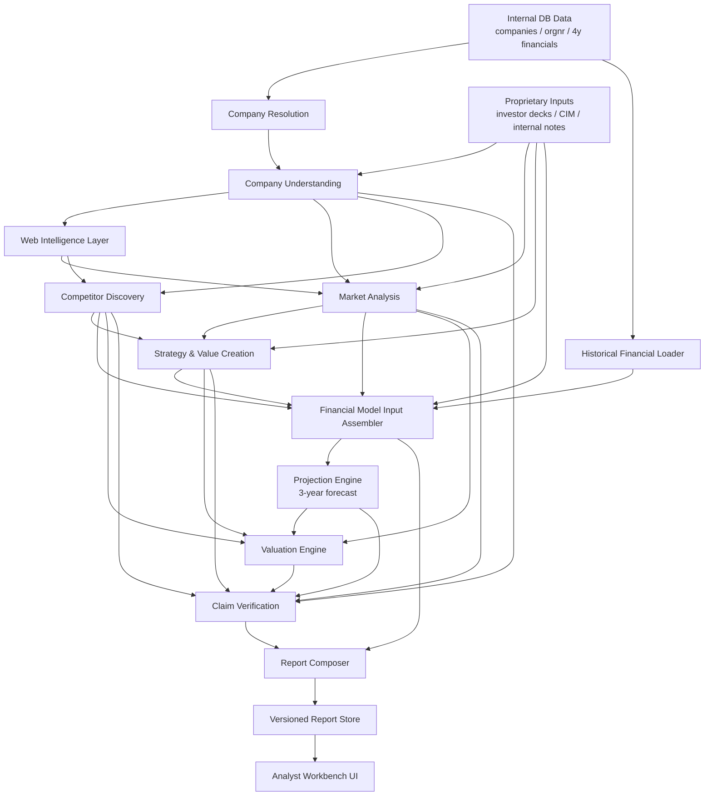

# FINAL_DEEP_RESEARCH_ARCHITECTURE.md

## Purpose

This document defines the recommended final architecture for the Nivo Deep Research system.

It assumes:
- the backend pipeline already runs end-to-end
- historical financials now reach the payload when identity is correct
- sequential gating and payload audits have highlighted the remaining weakness: company understanding and web evidence discovery

The architecture is designed to be:
- sequential and gated
- evidence-driven
- explicit about degraded states
- extensible with proprietary company materials
- bounded enough to let Deep Research reach a hard stop

---

## Core Principle

Deep Research must be a **gated evidence pipeline**.

Not:
- a loose parallel multi-agent swarm
- a report writer that hides missing data
- an LLM-first workflow with weak controls

The correct operating pattern is:

1. load trusted internal data
2. resolve company identity
3. understand what the company does
4. retrieve targeted public evidence
5. structure market and competitor understanding
6. build grounded projections
7. verify claims
8. generate the report from structured verified inputs

---

## Recommended Final Flow



---

## Layer 1 — Trusted Internal Data

### Inputs
- real orgnr
- canonical company record
- 4–5 years historical financials
- prior analyst overrides
- prior report versions if relevant

### Rules
- no synthetic tmp orgnr should survive if a real orgnr exists
- 4 historical years should be loaded whenever available
- derived history should be computed in backend code

---

## Layer 2 — Company Resolution

### Purpose
Resolve:
- canonical company name
- orgnr
- official domain
- identity confidence

### Inputs
- company_name
- optional provided orgnr
- main DB company record

### Output
A strong identity object.

### Gate
If identity is weak:
- block or explicitly degrade
- do not let downstream stages trust tmp identity

---

## Layer 3 — Company Understanding

### Purpose
Determine:
- what the company does
- which products/services it sells
- who it sells to
- geography
- business model
- target niche / market hypothesis

### Preferred evidence
- company website
- investor deck
- CIM
- internal notes
- product pages
- about pages

### OpenAI role
Use OpenAI here to:
- interpret messy company text
- classify products/services
- infer target customers
- summarize business model
- output structured JSON

### Output shape
```json
{
  "company_description": "...",
  "products_services": [],
  "business_model": "...",
  "target_customers": [],
  "geographies": [],
  "market_niche": "...",
  "confidence_score": 0.0,
  "source_refs": []
}
```

### Gate
Market retrieval must not proceed blindly until this stage is good enough.

---

## Layer 4 — Web Intelligence Layer

### Purpose
Discover public evidence only after company understanding is known.

### Recommended service
Tavily.

### Recommended split
- Tavily: retrieval engine
- Backend: ranking, dedupe, gating, provenance
- OpenAI: interpretation of selected evidence

### Outputs
- market sources
- competitor sources
- trade association sources
- news/trend sources
- extracted evidence candidates

### Important note
You may add a bounded complementary retrieval loop:
- if market analysis is below threshold
- or competitor evidence is too thin
- the system may trigger additional Tavily runs
- but only up to a configured max depth / query budget

Do not let this become an open-ended recursive crawl.

---

## Layer 5 — Market Analysis

### Purpose
Build:
- market label
- niche label
- market growth range
- demand drivers
- structural trends

### Inputs
- company understanding
- ranked market evidence
- proprietary market hints if available

### OpenAI role
Use OpenAI to synthesize and structure market evidence.
Do not use OpenAI to invent market size or growth.

---

## Layer 6 — Competitor Discovery and Profiling

### Purpose
Find:
- operating comparables
- positioning comparables
- benchmark hints

### Inputs
- company understanding
- market analysis
- ranked web evidence
- proprietary hints

### Rule
Competitor discovery must be based on known niche, not generic brand-name search alone.

---

## Layer 7 — Financial Model Input Assembler

### Purpose
Create one canonical `AnalysisInput` for:
- projection engine
- valuation engine
- report composer

### Required inputs
- real orgnr
- 4 years actual financials
- derived financial trends
- market growth assumptions
- competitor benchmark context
- value creation initiatives
- source quality / degradation flags
- proprietary company-specific facts when available

### Gate
No financial model should run before this payload passes completeness validation.

---

## Layer 8 — Projection Engine

### Purpose
Produce:
- 3-year projections
- assumptions source labels
- degraded warnings when assumptions are synthetic

### Rule
Use deterministic code for all calculations.

### Standard horizon
- 4 years actuals
- 3 years projected

---

## Layer 9 — Valuation Engine

### Purpose
Use:
- projections
- comparables
- market context
- uncertainty notes

### Rule
Valuation is deterministic and bounded.
OpenAI should not calculate valuation math.

---

## Layer 10 — Claim Verification

### Purpose
Ensure:
- report claims map to evidence
- unsupported numeric claims are blocked or marked
- degraded stages are surfaced

### Inputs
- company understanding
- market analysis
- competitor outputs
- model outputs
- valuation outputs
- source refs

---

## Layer 11 — Report Composer

### Purpose
Create the analyst-facing report from structured verified inputs.

### Inputs
- assembled analysis input
- verified claims
- degradation flags
- model outputs
- valuation outputs

### OpenAI role
Use OpenAI here only for narrative synthesis from already structured verified content.

---

## Layer 12 — Analyst Workbench

### Required screens
- run status
- latest report
- version history
- verification panel
- competitor editing
- assumption overrides

At that point, Deep Research should be considered MVP-complete.

---

## AI / Service Usage Strategy

### Deterministic backend handles
- orchestration
- DB lookups
- identity resolution
- stage gating
- completeness checks
- financial calculations
- valuation calculations
- verification persistence
- report versioning

### Tavily handles
- web discovery
- candidate source finding
- extract/crawl/map of public evidence
- complementary retrieval runs when evidence is thin

### OpenAI handles
- company understanding from messy text
- evidence interpretation
- structured market/competitor synthesis
- report narrative generation
- summarization of proprietary materials

### OpenAI should not handle
- raw crawling as primary engine
- DB truth
- financial math
- uncontrolled autonomous stage sequencing

---

## Sequential Gating Rules

### Gate 1 — Identity
No downstream stage should trust tmp identity when real identity is available.

### Gate 2 — Company Understanding
Market retrieval should not run until:
- business model is known
- product/service type is known
- target market/niche is hypothesized
- confidence exceeds threshold or degraded state is explicit

### Gate 3 — Market Inputs
Financial model should not run with market-driven assumptions unless market growth baseline exists or fallback is explicit.

### Gate 4 — Historicals
Projection engine should not prefer synthetic assumptions when 4-year actuals are available.

### Gate 5 — Report
Report should not present unsupported hard facts as verified output.

---

## Proprietary Input Strategy

Treat proprietary company materials as first-class evidence.

### Examples
- investor deck
- CIM
- management notes
- DD notes
- customer/channel hints
- internal assumptions

### Recommended implementation
Store them as source records with types such as:
- proprietary_investor_deck
- proprietary_internal_notes
- proprietary_management_input
- proprietary_market_hint

These should flow into:
- company understanding
- market framing
- value creation
- model assumptions
- report depth

---

## Hard Stop Scope

Deep Research should be considered complete when:
- the gated evidence pipeline works
- real historicals reach the model
- company understanding precedes market search
- public and proprietary evidence can refine the analysis
- report + verification + edit/recompute workbench exists

After that:
- do not add more core stages
- do not expand architecture endlessly
- move future work to phase 2
