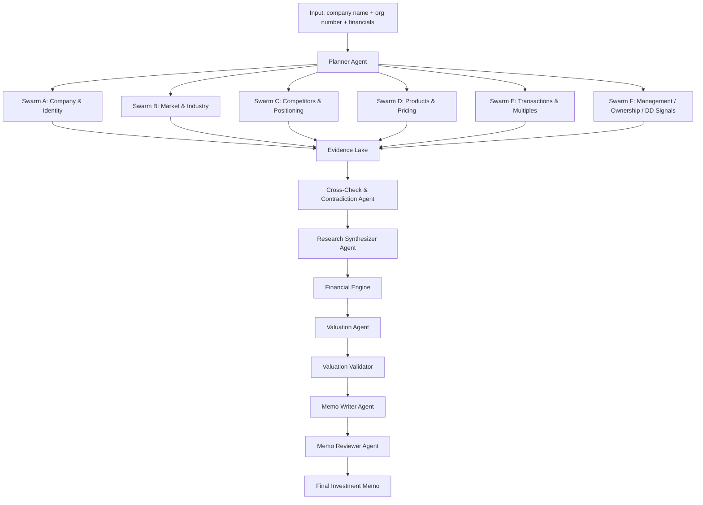

# NIVO_DEEP_RESEARCH_V3_SWARM_ARCHITECTURE.md
Status: Proposed v3 Architecture  
Purpose: Define a higher-performance swarm-based research architecture for Nivo Deep Research, optimized for investment-grade memo generation and controlled implementation planning.

---

# 1. Why v3

The current target architecture is strong, but still relatively linear:

- Resolver
- Market
- Competitors
- Products
- Transactions
- Valuation
- Memo writer

That is good for a first production system, but the Bruno-style output quality depends heavily on **depth, triangulation, and contradiction handling**.

A swarm architecture improves:

- research depth
- source diversity
- contradiction detection
- section quality
- robustness against a single weak agent
- final memo confidence

---

# 2. Core Principle

Instead of a single research chain, v3 uses:

1. **Planner**
2. **Parallel research swarms**
3. **Cross-check / contradiction layer**
4. **Synthesis**
5. **Validation**
6. **Memo generation**

Core philosophy:

Research in parallel → compare → adjudicate → synthesize → value → write

---

# 3. High-Level Architecture



---

# 4. Swarm Definitions

## 4.1 Swarm A — Company & Identity

Mission:

- verify legal entity
- official website
- description
- legal structure
- headquarters
- ownership clues
- core business model

Typical tools:

- web search
- Tavily search
- internal DB
- registry lookup functions

Deliverables:

- company profile
- identity confidence
- unresolved identity questions

---

## 4.2 Swarm B — Market & Industry

Mission:

- market size
- growth
- subsegments
- geographic mix
- customer split
- macro trends
- structural tailwinds / headwinds

Approach:

Run several micro-agents in parallel:

- Market sizing agent
- Industry trends agent
- Segment split agent
- Geography agent

Deliverables:

- quantified market range
- growth range
- trend set
- contradictions between sources
- confidence score

---

## 4.3 Swarm C — Competitors & Positioning

Mission:

- identify peers
- classify peer groups
- benchmark size
- estimate profitability
- infer positioning
- infer go-to-market differences

Sub-agents:

- peer discovery agent
- financial benchmarking agent
- positioning agent

Deliverables:

- comparable set
- competitor table
- positioning map
- peer rationale

---

## 4.4 Swarm D — Products & Pricing

Mission:

- product families
- pricing architecture
- premium / mid / low positioning
- product breadth
- archive / heritage / innovation cues
- channel mix clues

Sub-agents:

- product catalog agent
- pricing agent
- brand positioning agent

Deliverables:

- portfolio map
- pricing range
- product differentiation logic

---

## 4.5 Swarm E — Transactions & Multiples

Mission:

- find precedent transactions
- retrieve valuation references
- infer multiple ranges
- identify buyer patterns
- detect strategic vs financial sponsor behavior

Sub-agents:

- transaction search agent
- multiple extraction agent
- sector multiple agent
- buyer pattern agent

Deliverables:

- transaction table
- multiple range
- sector sanity reference
- quality score

---

## 4.6 Swarm F — Management / Ownership / DD Signals

Mission:

- management background
- ownership history
- governance signals
- export exposure clues
- unresolved DD issues
- operational fragilities

Sub-agents:

- management agent
- ownership / legal agent
- DD issues agent

Deliverables:

- diligence question list
- risk flags
- management / governance summary

---

# 5. Evidence Lake

All swarm outputs feed a central evidence lake.

Each evidence object should contain:

```json
{
  "run_id": "uuid",
  "swarm": "market",
  "agent": "market_sizing_agent",
  "fact_type": "market_size",
  "value": "SEK 270bn",
  "unit": "SEK",
  "region": "Europe",
  "confidence_score": 0.74,
  "source_count": 3,
  "sources": [
    {
      "url": "https://example.com",
      "title": "Market report",
      "date": "2025-09-01"
    }
  ],
  "contradiction_group": "market_size_europe",
  "status": "candidate"
}
```

This structure makes synthesis and contradiction handling much easier.

---

# 6. Cross-Check & Contradiction Layer

This is one of the most important upgrades in v3.

Instead of taking the first plausible answer, the system compares competing outputs.

Example contradiction cases:

- Market size source A says SEK 220bn, source B says SEK 310bn
- Competitor set from one branch differs materially from another
- One branch finds premium pricing, another suggests mid-market positioning
- DCF implies 11x EBITDA while transaction swarm implies 5.8x

The contradiction agent should:

1. group candidate facts by contradiction group
2. compare value proximity, source quality, and source diversity
3. choose one of:
   - accept consensus
   - convert to range
   - escalate as unresolved
   - request targeted re-research

Output example:

```json
{
  "fact_group": "market_size_europe",
  "resolution": "range",
  "accepted_value_low": "SEK 240bn",
  "accepted_value_high": "SEK 290bn",
  "reason": "source divergence too high for single-point estimate",
  "needs_manual_review": false
}
```

---

# 7. Research Synthesizer Agent

The synthesizer does not do raw discovery.

It takes vetted evidence and builds section-level intelligence:

- company overview packet
- market packet
- competitor packet
- product packet
- DD packet

This should be the main bridge between swarm research and memo writing.

Responsibilities:

- compress evidence into section packets
- preserve ranges and uncertainty
- produce section-level confidence
- maintain explicit unsupported questions

---

# 8. Valuation in v3

Valuation still remains controlled and should not be replaced by free-form memo reasoning.

Valuation inputs come from:

- normalized financials
- market / competitor packet
- transaction packet
- sector sanity references

Recommended precedence:

1. precedent transactions
2. comparable public / private peers
3. sector sanity range
4. DCF as cross-check

Valuation agent should output:

- EV low / base / high
- implied EV/EBITDA
- primary method
- range rationale
- warnings

Valuation validator should test:

- EV-to-equity bridge
- net debt sign
- sector sanity range
- terminal value dominance
- scenario directionality
- conflict with transaction swarm

---

# 9. Memo Generation in v3

The memo writer should receive a final validated packet, not raw search results.

Suggested memo sections:

1. Executive Summary
2. Company Overview
3. Market Analysis
4. Competitive Landscape
5. Product & Pricing Analysis
6. Value Creation Plan
7. Financial Analysis
8. Valuation
9. Scenario Analysis
10. Risks
11. Due Diligence Questions
12. Appendix / Evidence Notes

The memo reviewer agent should be harsh and explicit.

It should tag claims as:

- validated
- estimated
- inferred
- unsupported
- requires DD confirmation

---

# 10. Why This Is Better Than v2

v2 is a strong orchestrated agent workflow.

v3 improves on it by adding:

- true parallelism
- contradiction handling
- research redundancy
- higher source diversity
- stronger synthesis discipline
- better DD question generation

That is much closer to how a high-performing PE team actually works:
multiple streams of analysis, then internal debate, then a synthesized investment view.

---

# 11. When to Use v3

Use v3 if the objective is:

- premium research quality
- deep memo generation
- maximum resemblance to professional PE memos
- high-value opportunities where analyst time matters less than output quality

Use v2 if the objective is:

- MVP
- faster rollout
- lower implementation complexity

Recommended path:

- build v2 first
- add v3 swarm mode as premium / full research mode

---

# 12. Suggested Implementation Path

Phase 1:
Build v2 foundation.

Phase 2:
Introduce evidence lake and contradiction grouping.

Phase 3:
Split research into swarm branches.

Phase 4:
Add contradiction agent and synthesizer.

Phase 5:
Make planner decide between:
- quick mode
- standard mode
- full swarm mode

---

# 13. Planner Modes

The planner should be able to launch different modes.

## Quick Mode
Fast screen, lightweight research.

## Standard Mode
Full v2 research pipeline.

## Full Swarm Mode
Deep parallel research with contradiction handling and strict validation.

Full swarm mode is the appropriate mode for Bruno-style output.

---

# 14. Summary

v3 converts Nivo from an agent pipeline into a research operating system.

That is the architecture most likely to produce:
- deep analysis
- robust source coverage
- professional memo quality
- investment-grade outputs
