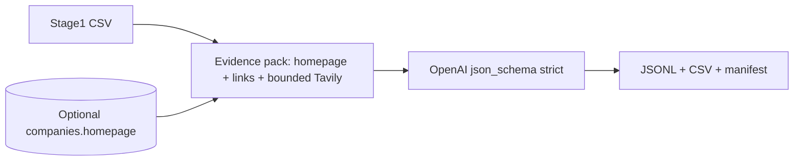

# Screening Layer 2 — lightweight web-evidence classifier

**Status:** Implemented (batch script + library)  
**Audience:** Operators running Stage 1 CSV → structured JSON/CSV  
**Out of scope:** Deep research, multi-agent flows, UI, campaigns, new DB tables.

---

## 1. Technical design

### Purpose

Layer 2 sits **after** deterministic `screening_rank_v1.py`. It uses **only a small, deterministic fetch** of public HTML (homepage + a few guessed paths) and **one LLM call per company** to produce a **strict JSON** classification: business type, operating model, red flags, and a conservative fit signal for Nivo’s thesis (product-led, differentiated, scalable where evidenced).

### Data flow



### Evidence pack (bounded, input-driven)

- **Source of truth:** rows in the input CSV (plus optional `homepage` from `companies` when `--enrich-homepage-from-db`). No name-based web search as the primary path.
- **Homepage first:** normalize URL from input/DB; GET with timeout and `User-Agent`; no headless browser.
- **Same-origin links only:** parse `<a href>` on the homepage; choose at most **one** About/Company-style link and **one** Products/Services-style link (regex on URL + anchor text). No fixed `/about` path guessing.
- **Hard limits:** max **4** successful page bodies total (homepage + follows + optional corroboration). Request timeout `REQUEST_TIMEOUT` in `evidence_fetch.py`.
- **Tavily (secondary):** one Search when homepage is missing, the homepage fetch fails, or substantive text from direct fetches is still below threshold. Snippets from top results may be added without counting as full pages. Optionally fetch one Tavily-picked official URL if none succeeded; at most **one** off-domain page via Tavily Extract or httpx. Uses `TavilyClient` from `backend/services/web_intel/tavily_client.py` (requires `TAVILY_API_KEY` / settings).
- **Output metadata (runner merges, not LLM):** `pages_fetched_count`, `homepage_used`, `tavily_used`, `evidence_urls`.

### LLM contract

- **Model:** `SCREENING_LAYER2_MODEL` or default `gpt-4o-mini`.
- **Temperature:** low (default `0.2`).
- **Response:** OpenAI **strict JSON Schema** matching `Layer2Classification` (`backend/services/screening_layer2/models.py`).

### Blend with Stage 1 (default)

```
stage1_norm = clamp(stage1_total_score, 0, 100) / 100
layer2_signal = fit_confidence * (1.0 if is_fit_for_nivo else 0.15)
blended_0_100 = 100 * (w_stage1 * stage1_norm + w_layer2 * layer2_signal) / (w_stage1 + w_layer2)
```

Defaults: `w_stage1=0.4`, `w_layer2=0.6` (CLI flags `--w-stage1`, `--w-layer2`). Implementation: `backend.services.screening_layer2.blend.blend_score`.

### Failure handling

- Fetch/OpenAI errors: JSONL line with `error` field; CSV row included for traceability.
- No homepage: model is instructed to classify conservatively from name + Stage 1 score only.

### Artifacts

| File | Role |
|------|------|
| `layer2_results_<ts>.jsonl` | One JSON object per line (success or error) |
| `layer2_results_<ts>.csv` | Flattened columns + `blended_score` |
| `layer2_manifest_<ts>.json` | Run metadata + blend formula |

---

## 2. Prompt template

See `backend/services/screening_layer2/prompts.py`:

- **`SYSTEM_PROMPT`** — rules: conservative, no invented financials, enum usage, red_flags / evidence format.
- **`USER_PROMPT_TEMPLATE`** — orgnr, name, Stage 1 score, evidence pack body.

---

## 3. JSON schema / Pydantic

- **Pydantic:** `Layer2Classification` in `backend/services/screening_layer2/models.py`.
- **OpenAI strict schema:** `openai_json_schema_strict()` (same fields, `additionalProperties: false`).

---

## 4. Batch runner

```bash
cd /path/to/nivo
export PYTHONPATH=.
python3 scripts/screening_layer2_run.py \
  --input /tmp/screening_top300.csv \
  --out-dir /tmp/layer2 \
  --limit 300 \
  --enrich-homepage-from-db
```

Requires `OPENAI_API_KEY`, optional `TAVILY_API_KEY` for fallback retrieval, and (for DB) `DATABASE_URL`.

---

## 5. Operational notes

- **Rate limits:** `--sleep` between calls (default 0.4s).
- **Cost:** ~1 chat completion × N companies; keep `--limit` for pilots.
- **Robots / ToS:** Use only public pages; respect site policies in production runs.
