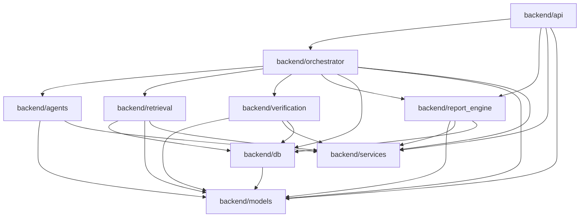

# Nivo Deep Research - Module Dependency Map

## 1) Target backend module map

```text
backend/
  api/              # HTTP layer only
  orchestrator/     # Run coordination + stage transitions
  agents/           # LLM agents, prompts, structured outputs
  retrieval/        # DB + URL-based context collection, enrichment assembly
  verification/     # Quality checks, evidence checks, moderation gates
  report_engine/    # Canonical report composition and rendering DTOs
  services/         # Shared utilities/adapters
  models/           # Domain + API data models
  db/               # Repositories, SQL adapters, transaction boundaries
```

---

## 2) Allowed dependency graph (authoritative)



Dependency rules:

- `api` must not import low-level SQL or direct model-provider SDKs.
- `agents` must not call database directly (through orchestrator or retrieval-supplied context).
- `retrieval` can read from DB and external URLs only when URL is already known.
- `verification` is the final gate before report publication.
- `report_engine` should be deterministic and side-effect-light (writes delegated to `db`).

---

## 3) Runtime flow mapping

## A. Standard deep analysis run

1. `api` receives request and validates payload.
2. `orchestrator` creates/updates run record via `db`.
3. `orchestrator` calls `retrieval` for stage context.
4. `orchestrator` calls `agents` for screening/deep outputs.
5. `orchestrator` calls `verification` to score/validate outputs.
6. `orchestrator` calls `report_engine` to build canonical report.
7. `db` persists stage artifacts + report projections.
8. `api` returns response DTO from `report_engine`.

## B. Run history/read path

1. `api` receives query (`runId`, history, filters).
2. `report_engine` builds response DTO from persisted artifacts via `db`.
3. `api` returns stable contract payload.

---

## 4) Data ownership by module

| Module | Owns/Produces | Reads |
|---|---|---|
| `db` | persistence APIs, transaction semantics | all persisted tables |
| `models` | typed schemas/DTOs | none |
| `retrieval` | normalized research/evidence package | companies, kpis, enrichment, URLs |
| `agents` | structured AI outputs | retrieval package + model configs |
| `verification` | pass/fail + quality diagnostics | agent outputs + evidence package |
| `report_engine` | canonical report + endpoint projections | verified outputs + persisted artifacts |
| `orchestrator` | run lifecycle + stage order | all upstream module outputs |
| `api` | transport contracts | orchestrator/report output |

---

## 5) Mapping from current code to target modules

Current -> Target:

- `backend/api/ai_analysis_api.py`, `backend/api/analysis.py`
  - retain request routing in `api`
  - move business orchestration logic to `orchestrator`

- `backend/analysis/workflow.py`
  - core sequence logic -> `orchestrator`

- `backend/analysis/stage2_research.py`, `backend/agentic_pipeline/web_enrichment.py`
  - merge into `retrieval`

- `backend/analysis/stage3_analysis.py`, `backend/agentic_pipeline/ai_analysis.py`
  - agent prompts/model calls -> `agents`

- moderation and output checks currently implicit
  - formalize into `verification`

- report-shaping logic spread across API/services
  - centralize into `report_engine`

- `backend/services/postgres_db_service.py` + direct SQL in routers/workflow
  - keep infra in `services` short-term
  - extract repositories into `db` module

---

## 6) Anti-patterns to block

1. API router performing raw SQL writes.
2. Agent module directly importing router or request objects.
3. Retrieval module constructing HTTP response payloads.
4. Report engine invoking model APIs.
5. Multiple modules mutating run status without orchestrator mediation.

---

## 7) Suggested package-level import policy

Use static lint checks to enforce:

- `backend/api/*` cannot import `backend/analysis/*` or legacy `backend/agentic_pipeline/*` after migration complete.
- `backend/agents/*` cannot import `backend/db/*`.
- only `backend/orchestrator/*` can update run state transitions in `acquisition_runs`.
- `backend/report_engine/*` must consume verified outputs, not raw model text.

---

## 8) Incremental migration strategy

1. Introduce new modules in parallel.
2. Add adapter layer from old code paths to new interfaces.
3. Cut one endpoint at a time to the new orchestrator.
4. Remove legacy paths once parity tests pass.

This minimizes risk while preserving current endpoint behavior during transition.

