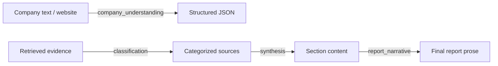

# OpenAI Payload Audit

## Current State

OpenAI is **not used** in the core pipeline agent stages. All 10 pipeline agents are heuristic/rule-based.

OpenAI is currently used for:

- **Embeddings** — `text-embedding-3-small` for retrieval chunking and semantic search in the source storage layer.
- **AI Lab agentic pipeline** — A separate system (not Deep Research core) that uses OpenAI for conversational analysis.

The core pipeline nodes (identity through report_generation) execute deterministic logic, DB lookups, and rule-based extraction without LLM calls.

---

## Recommended LLM Introduction Points

Per `docs/deep_research/FINAL_DEEP_RESEARCH_ARCHITECTURE.md`, LLM should be introduced at these specific points:

| Purpose | Stage | What LLM Does |
|---|---|---|
| Company understanding | After identity, before market retrieval | Interpret messy company text → structured JSON (products, business_model, customers, geographies, niche) |
| Report narrative | report_generation | Synthesize structured verified content into readable analyst prose |
| Classification | Source ingestion / retrieval | Categorize sources and evidence by type and relevance |
| Synthesis | Per-section analysis | Combine evidence chunks into coherent section content |

---

## Payload Contracts Per Stage

Defined in `backend/llm/payload_contracts.py`.

### company_understanding

| Field | Value |
|---|---|
| Required inputs | `company_name`, `raw_text` |
| Model | gpt-4o-mini |
| Max tokens | 2000 |
| Retry budget | 2 |

### report_narrative

| Field | Value |
|---|---|
| Required inputs | `company_name`, `sections_data`, `analysis_input` |
| Model | gpt-4o |
| Max tokens | 4000 |
| Retry budget | 1 |

### classification

| Field | Value |
|---|---|
| Required inputs | `text`, `categories` |
| Model | gpt-4o-mini |
| Max tokens | 500 |
| Retry budget | 2 |

### synthesis

| Field | Value |
|---|---|
| Required inputs | `company_name`, `evidence_chunks`, `section_key` |
| Model | gpt-4o |
| Max tokens | 3000 |
| Retry budget | 1 |

Payload validation is enforced via `validate_llm_payload()` — missing required fields block the LLM call.

---

## Cost-Control Policy

### Model selection

- **gpt-4o-mini** for classification and extraction tasks (low cost, sufficient quality).
- **gpt-4o** for synthesis and narrative generation (higher quality required).

### Token limits

Every stage has a hard `max_tokens` cap defined in `MAX_TOKENS_PER_STAGE`.

### Retry budget

Defined in `RETRY_BUDGET` per stage. Classification/extraction get 2 retries; narrative/synthesis get 1.

### Cost estimation

`estimate_cost()` uses per-model pricing tables (`COST_PER_1K_INPUT`, `COST_PER_1K_OUTPUT`) to compute USD estimates per call.

### Call logging

Every LLM invocation is recorded as an `LLMCallRecord` containing:
- `run_id`, `stage`, `model`
- `input_tokens`, `output_tokens`
- `latency_ms`, `cost_estimate_usd`
- `success`, `error`

Logging implementation: `backend/llm/llm_call_logger.py`.

---

## Blocked Roles

LLM must **never** be used for the following purposes (enforced by `BLOCKED_LLM_ROLES` and `is_allowed_llm_role()`):

| Blocked Role | Reason |
|---|---|
| `financial_math` | All financial calculations must be deterministic code |
| `valuation_calculation` | Valuation is bounded and code-driven |
| `orchestration` | Pipeline control flow is deterministic via LangGraph |
| `raw_crawling` | Web discovery is handled by Tavily/SerpAPI |
| `db_truth` | PostgreSQL is the source of truth; LLM must not override DB state |
