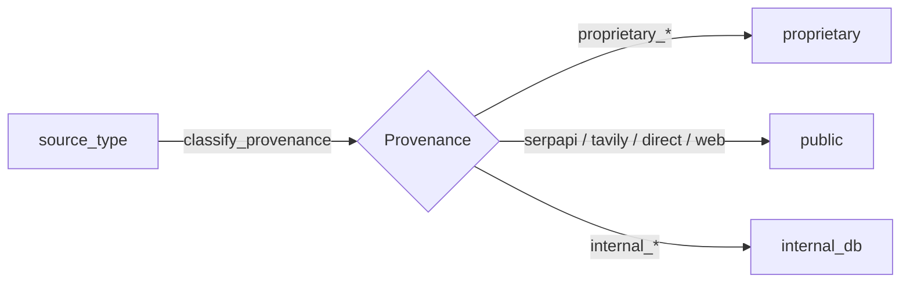
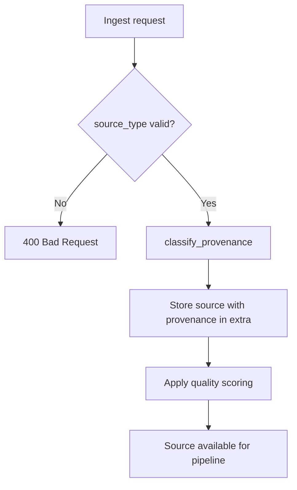

# Proprietary Input Integration Spec

## Source Taxonomy

Defined in `backend/services/deep_research/source_taxonomy.py`.

### Proprietary sources

| Source Type | Description |
|---|---|
| `proprietary_investor_deck` | Investor presentation / pitch deck |
| `proprietary_cim` | Confidential Information Memorandum |
| `proprietary_internal_notes` | Internal analyst or deal team notes |
| `proprietary_management_input` | Management-provided data or narratives |
| `proprietary_market_hint` | Insider market intelligence / hints |
| `proprietary_dd_notes` | Due diligence notes |

### Public sources

| Source Type | Description |
|---|---|
| `serpapi` | SerpAPI search results |
| `tavily` | Tavily retrieval results |
| `direct` | Direct URL fetch |
| `web` | General web source |

### Internal DB sources

| Source Type | Description |
|---|---|
| `internal_financials` | Historical financial records from main app DB |
| `internal_crm` | CRM data from main app DB |

Validation: `is_valid_source_type()` checks against `ALL_VALID_SOURCE_TYPES`.

---

## Provenance Model

Every source receives a provenance label from the set `{"public", "proprietary", "internal_db"}`.

### Classification

- Auto-classified from `source_type` via `classify_provenance()`.
- Stored in `source.extra["provenance"]` metadata dict.
- Surfaced in `SourceRef.provenance` within the assembled `AnalysisInput`.

### Downstream visibility

- `AnalysisInput.proprietary_source_count` — integer count of proprietary sources for this run.
- `SourceRef` carries the `provenance` field so reports can distinguish evidence origin.
- Debug artifact includes proprietary sources summary.

---

## Ingest Contract

Sources are ingested via the retrieval API:

- **Endpoint**: `POST /sources/ingest`
- **Required field**: `source_type` — must be a member of `ALL_VALID_SOURCE_TYPES`
- **Auto-classification**: Provenance is derived from source_type; can be overridden via an optional `provenance` parameter
- **Quality scoring**: Applied to all sources regardless of provenance via `backend/retrieval/source_scoring.py`

### Validation flow

---

## Assembly Rules

The `AnalysisInputAssembler` (`backend/services/deep_research/analysis_input_assembler.py`) handles proprietary sources as follows:

1. **Source loading** — `_load_source_refs()` loads all sources for the run, reads `extra["provenance"]`, and counts proprietary sources.

2. **SourceRef propagation** — Each `SourceRef` carries:
   - `source_id`
   - `title`, `url`, `source_type`
   - `provenance` (public | proprietary | internal_db)

3. **Proprietary count** — `AnalysisInput.proprietary_source_count` is set during assembly.

4. **Debug artifact** — `build_debug_artifact()` includes a `proprietary_sources_summary` section listing proprietary source types and counts.

5. **No special filtering** — Proprietary sources flow into the same evidence pipeline as public sources. The provenance label allows downstream consumers (reports, verification) to distinguish origin.

---

## Privacy Boundaries

### Company-scoped isolation

All sources are scoped to `run_id` + `company_id`. The `Source` table enforces this via foreign keys.

### No cross-company leakage

- `AnalysisInputAssembler.assemble()` always filters by `(run_id, company_id)`.
- Source queries in `_load_source_refs()` use both run and company filters.
- No API endpoint exposes sources without run-level authorization.

### Report provenance labels

- Reports can flag which claims are backed by proprietary vs public evidence.
- Provenance labels are carried through `SourceRef` into the report composer.
- This enables analysts to see whether a claim is supported by internal knowledge or public discovery.
