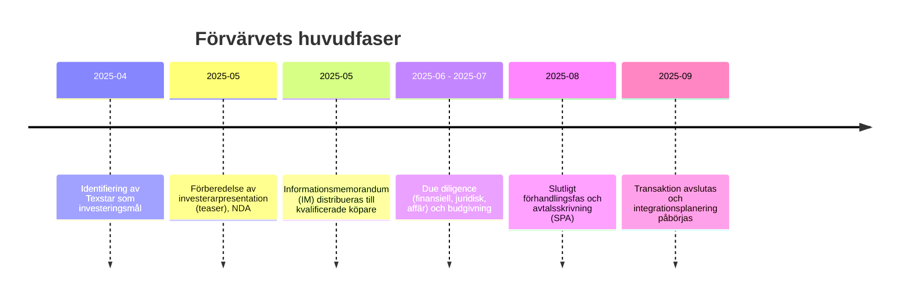

# Sammanfattning  
Texstar AB är ett svenskt företag (huvudkontor Norrtälje) som designar och säljer profil- och arbetskläder med egen produktion i Kina【6†L1-L9】. Företaget har länge vuxit kraftigt – omsättningen steg till 121,7 MSEK 2022 – men har de senaste åren mattats av. År 2024 landade intäkterna på ~91 MSEK (–18,6% YoY) och rörelsemarginalen på cirka 2,8%【7†L448-L456】【9†L2-L9】. Texstars affärsmodell är B2B, med försäljning via egna och fristående återförsäljare (profilåterförsäljare) som får egna webbutiker med hela Texstars sortiment och stöd för logistik, lagerhållning och profilering【71†L129-L137】【38†L142-L146】.  Nyckelvärden är relativt låga rörelsemarginaler (typ ~3–8%) och hög kapitalbindning i lager (ca 75 MSEK). Bolaget har 22 anställda (2024) och hade ett nettovinst på ~0,8 MSEK 2024【9†L2-L9】. 

【59†embed_image】Texstar har erbjudit stora företagskunder anpassade webshops med skräddarsytt sortiment, lagerhantering och leveransservice via sina profilåterförsäljare【71†L129-L137】【38†L142-L146】. Intäktskällor är produktförsäljning (kläder och profilprodukter), med återkommande behov vid tillskott av personal eller byten av profilplagg. Den geografiska närvaron är främst Sverige (inklusive Norden), men språkalternativ på webbplatsen antyder även närvaro i övriga Europa.  Teknologin består av en egen e-handelsplattform åt resellers och eget varumärke (“Texstar”), där MyLogo-verktyget underlättar profiltryck. 

# Affärsmodell och erbjudande  
Texstar är helt vertikalt integrerat – design i Sverige, egen produktion (via dotterbolag) i Shanghai och lager i Norrtälje【6†L1-L9】.  Genom sina märkeskollektioner (profilsortiment, arbetskläder, hi-vis, vårdkläder m.fl.) riktar man sig främst till företag som vill klä sina anställda i enhetliga plagg med logotyp. 
- **Kunder:** Större företag och myndigheter, via egen försäljning och ett brett nät av cirka 150 profilåterförsäljare i hela landet【71†L129-L137】【38†L142-L146】. Resellers paketerar Texstarprodukter som en del av egna erbjudanden (profilkläder, presentreklam etc.). Typiska kundsegment är företag inom industri, bygg, service, handel, hotell & restaurang, sjukvård etc. 
- **Produkter:** Kläder (jackor, byxor, pikéer, pikétröjor, PLU-kläder för omsorg etc.) byggda på funktion och kvalitet. Sortimentet inkluderar även profileringsartiklar och skor (via underleverantörer).  Egen kollektion med stark kundanpassning (många färger/tyger, logotyptillämpning på fabriken, MyLogo-verktyg) ger differentiering. 
- **Intäktsmodell:** Försäljning av produkter är huvudsaklig intäkt, med viss återkommande försäljning när företag köper påfyllning eller nya kollektioner. Det finns också intäkter från logistik- och lagerhanteringstjänster.  Huvudsakligen enstaka fakturor per order, men beroende på stora flöden kan löpande beställningsavtal förekomma. 
- **Geografi:** Huvuddelen av försäljningen är i Sverige. Texstar kommunicerar via svenska, finska, norska och holländska webbplatser, vilket indikerar närvaro i Norden och potentiellt Benelux. Den storskaliga produktionen i Kina antyder dock att de även kan skala för export. 

# Senaste finansiella nyckeltal  
Texstars senaste redovisade år (2024) visar vikande försäljning och fallande resultat:  
- **Omsättning:** 91,1 MSEK (2024) efter toppnotering på 121,7 MSEK 2022【8†L104-L108】. Tillväxten var –18,6% ’23–’24【9†L2-L9】. 
- **Bruttomarginal:** Cirka 46% (oms – varukostnad) 2024, relativt stabil på 46–49% de senaste åren【7†L423-L430】. 
- **Rörelseresultat (EBIT):** 2,6 MSEK 2024 (2,8% av oms), mot 9,4 MSEK 2023 (8,4%) och 18,5 MSEK 2022 (15,2%)【8†L104-L112】. EBITDA 2024 var ~3,4 MSEK【8†L112-L120】. Vinsten efter skatt 2024 blev 0,8 MSEK (margin ~0,9%)【9†L2-L9】. 
- **Balansräkning:** Eget kapital ca 61 MSEK, soliditet ~55%. Mycket av balansen är i lager (~75 MSEK) och kundfordringar (~21 MSEK)【10†L148-L156】【9†L2-L9】.  Likvida medel ~10 MSEK. Kortfristiga skulder är relativt låga (~9 MSEK)【10†L160-L164】, vilket ger en kassalikviditet på drygt 100%. Stora lager innebär dock hög rörelsekapitalbindning, vilket ger svag balanslikviditet. 
【63†embed_image】**Figur: Omsättnings- och marginaltrend**. Texstars omsättning har fallit kraftigt efter 2022, och marginalerna har pressats. (Bild: generisk illustration av tillväxt, källa: Texstars årsredovisningar och UC【9†L2-L9】.) 
- **Kassaflöden:** Fritt kassaflöde är inte offentligt, men den stora lagerökningen under högre tillväxtår indikerar att bolaget bundit kapital i lager (lager steg från 46 MSEK 2020 till 92 MSEK 2022【7†L423-L430】). Eventuella investeringar i it-plattform och anläggning är små (omslaget har inga immateriella tillgångar).  
- **Tillväxt:** Omsättningstillväxten har varit negativ – efter +19% 2021–22 och –8% 2022–23, sjönk till –18,6% 2023–24【9†L2-L9】. Det är tydligt att Texstar tappat moment och möjligen marknadsandelar samtidigt som större konkurrenter (se nedan) vuxit eller konsoliderat.  

# Marknad och affärsmöjligheter  
Marknaden för profil- och arbetskläder i Sverige är fragmenterad men mognar långsamt. Huvuddrivare är att företag och offentliga verksamheter ställer krav på profilering och arbetsmiljö (säkerhet, bekvämlighet). Flera faktorer påverkar:  
- **Marknadsstorlek:** Svårt att avgränsa exakt, men hela svenska detalj- och partihandeln med kläder är i storleksordningen tiotals miljarder SEK årligen.  Prognoser tyder på moderat tillväxt för arbets-/profilkläder i Sverige (~2–5% CAGR) de kommande åren (drivet av återhämtning i bygg- och industrisektorer samt ökade hygienkrav i vård/hotell)【31†L25-L33】.  Innovationskrav som smarta material och hållbarhet (textilåtervinning) påverkar långsiktigt.  
- **Adressbart marknad:** Texstars primära adress är företag och organisationer i Sverige (några nordiska länder) som köper arbetskläder i volym. Den direkta marknaden (yrkes- och profilkläder för B2B) kan uppskattas till kanske ~5–10 miljarder SEK i Sverige. Texstars ~91 MSEK utgör därmed någon promille av totalt B2B-klädhandeln. Marknaden är dock starkt fragmenterad bland nationella och lokala distributörer. Globalt växer segmentet långsamt, se även rapporter som spår <3–4% CAGR för workwear【31†L25-L33】【32†L28-L33】. 
- **Kundkoncentration:** Texstar har många relativt små kunder (genom återförsäljare), vilket minskar beroendet av enstaka stora avtal. Ingen enskild kund tros stå för mer än några procent av omsättningen. Det finns dock nischade stora kunder (t.ex. sjukhus, kommuner) som kan stå för större andelar vid specifika kampanjer – men inget offentligt som indikerar allvarlig kundrisk. 
- **Försäljningskanaler och prissättning:** Försäljningen sker främst via återförsäljarnät med digitala beställningsportaler【71†L129-L137】. Texstars hemsida antyder också att viss direktförsäljning finns (t.ex. menylänken “Contact”). Marginalen påverkas av traditionell handelsupplägg (inköp i Kina, grossistpris till återförsäljare). Prissättningen kan antas vara marknadsmässig för segmentet (ca 15–20% bruttovinst på rekommenderat pris). Kundernas priskänslighet är hög, varför Texstar betonar anpassning och snabb leverans som konkurrentfördel. 
- **Marknadstrender:** Ökad fokusering på hållbarhet och CSR driver krav på retursystem och återvunnet material, vilket kan bli en framtida försäljningsmöjlighet för en leverantör som kan leverera certifierade produkter. Digitalisering (e-beställningsplattformar) är en del av konkurrensbilden.  

# Konkurrenslandskapet  
Texstar verkar i ett konkurrensutsatt segment av profil- och arbetskläder där både etablerade och mer nischade aktörer tävlar. De största svenska konkurrenterna är:  
- **Blåkläder AB (privat)** – Ledande svensk aktör inom arbetskläder, med starka varumärken och brett nätverk. Omsatte 2,139 MSEK 2024 med ca 15,6% EBITDA (332 MSEK) och vinstmarginal ~11%【22†L74-L79】. Blåkläder har 300+ anställda och säljer via eget sälj/distribution och internationellt.  
- **Fristads AB (Hultafors Group)** – Ingår i Hultafors Group (ägs av Latour). Omsättning 1,278 MSEK 2023 med 18,6% rörelseresultat (237 MSEK)【41†L79-L82】. Fristads har stark ställning i bygg- och industri­segmenten och innehåller även ProJob-varumärke för funktionskläder.  
- **Jobman Texet AB (New Wave Group)** – Nybildat dotterbolag 2023 (fusion av Jobman Workwear och Texet). Omsatte 186 MSEK 2024 och gick med förlust (–76 MSEK efter finans【27†L53-L58】). Ägs av börsnoterade New Wave Group (profilkläder, presentreklam), och riktar sig mot bygg, hantverk, hotell/restaurant osv. Marginalerna är för närvarande mycket pressade, men företaget är en profilkollektionsspecialist.  
- **Övriga aktörer:** Flera mindre lokal- och regionföretag (t.ex. *ARAXA Profilkläder*, *WorkinWear*, *Kappahl Industri* m.fl.) och nordiska konkurrenter (t.ex. *Svea Science Park/Yppi*, *Jobman Norway*), samt internationella kedjor (t.ex. Portwest, Engelbert Strauss). Ingen annan är lika renodlad svensk profilgrossist med internationell produktion som Texstar.  

【64†embed_image】Den svenska marknaden domineras av större starka varumärken (blåkläder, Fristads/Jobman etc.) och ett brett fält av mindre aktörer. Texstar positionerar sig med lågkostnadsproduktion (egen fabrik) och digitala kanaler, men har en låg rörelsemarginal jämfört med dessa större konkurrenter【22†L74-L79】【41†L79-L82】.  I kundernas ögon är dock Texstar konkurrenskraftigt på pris, brett färgval och logistikstöd, medan större konkurrenter fokuserar mer på premiumsegment eller fullservice (exempelvis stor lagerkapacitet eller komplett skyddsutrustning). 

# SWOT-analys  
- **Styrkor:** Vertikal kontroll (egen produktion i Kina) ger låga kostnader och kapacitet för anpassning. Brett produktutbud och etablerat återförsäljarnät i Sverige ökar marknadstäckning. Hög digital mognad med egna e-handelslösningar (webbshoppar för varje kund) ger effektiv orderhantering och kundlojalitet. God lönsamhet under toppåren visar potentialen vid högre omsättning.  
- **Svagheter:** Låg lönsamhet (nu <3% EBIT) och lågt rörelsekapitalutnyttjande (kraftigt lagerbindning) ökar risk vid svängningar. Inga immateriella tillgångar eller starkt varumärke utanför B2B-nischen. Beroende av externa återförsäljare gör marginalen känslig för mellanledens prisnedslag och konkurrens. Avsaknad av diversifierade inkomstströmmar (t.ex. tjänster eller prenumerationer) är en begränsning.  
- **Möjligheter:** Konsolidering i branschen – större aktörer söker förvärv och mindre spelare fonderas ut, vilket skapar förvärvsintresse. Ökad efterfrågan på profilmarknaden, främst genom fokus på arbetsmiljö, digitala plattformar och hållbarhet, kan driva tillväxt. Eventuell expansion geografiskt (ex. Norden) eller produktsegment (skyddskläder, skor) kan öka intäkter och sprida risker.  Effektivisering av lagerhantering och just-in-time-leveranser är också potentiell förbättring.  
- **Hot/Risker:** Kraftig prispress i branschen (customers shopping around on price) kan ytterligare pressa redan tunna marginaler. Kundernas återhållsamhet vid konjunkturfall (bygg/industri svikt) hotar intäkter; vår/höstsäsong kan vara krympande. Hög valuta- och råvarukänslighet (textil), samt logistikutmaningar (pandemiförseningar, containerpriser), innebär volatilitetsrisk. Regulatory risk är låg (ingen särskild lagstiftning för profilkläder), men ökad hållbarhetsreglering (t.ex. textilåtervinningskrav) kan ge både kostnads- och anpassningskrav. 

# Värderingsindikatorer och scenarier  
Eftersom Texstar är onoterat saknas direkt börsvärde. Vi kan skatta några jämförbara multiplar:  Större jämförbara kan ge *EV/EBITDA* på ~8–10x (Fristads/Blåkläder om de var börsnoterade), medan små nischgrossister ofta värderas lägre (5–8x). Texstars låga rörelsemarginal och fallande omsättning talar för en lägre multipel. Antaganden: om Texstar kan vända lönsamheten mot ~8–10 MSEK i EBIT (~10% marginal vid stabil omsättning) kan ett hypotetiskt börsvärde på 80–100 MSEK (8–10x EBITDA) vara rimligt.  Med en konservativ multipel 5–7x skulle ett lägre intervall ~40–60 MSEK framkomma.  Som jämförelse hade Jobman Texet negativt resultat (inte tillämpligt) och Blåkläder med ~332 MSEK EBITDA; om Blåkläder värderades till säg 10x EBITDA (3,325 MSEK) motsvarar det högre nivån.  

**Indikativ värderingsintervall:** 40–100 MSEK (beroende av förhandlingsstyrka, synergier och framtidsutsikter). En köpare bör pruta för den tillfälliga svackan i omsättning och den höga kapitalbindningen. 

【68†embed_image】**Figur: Konkurrentjämförelse.** Texstar (i mitten med gul färg) jämförs med tre större svenska konkurrenter vad gäller omsättning, EBIT-margin och tillväxt【22†L74-L79】【27†L53-L58】. Texstar är klart mindre i omsättning och har lägre lönsamhet. (Data: Allabolag/UC; Texstar från senaste årsredovisning.)  

# Risker och nyckelvärderare  
**Drivkrafter:** Nyckeltal som investerare bör granska inkluderar marginaler (brutto och rörelse), lageromsättningshastighet, kundefterfrågan och kontraktsbeständighet. Hög **grossmarginal** (nu ~46%) är lovande, men låg **driftmarginal** innebär att varje procents försäljningsfall hårt slår resultatet. Tillväxten är avgörande: negativ tillväxt bör vändas (ny kundanskaffning, nya segment) för att värdering ska förbättras. **Kundlojalitet och churn** är kritiskt (hur stor andel kunder återbeställer?). Återkommande beställningar från större företag är ett starkt värdebevis.  Baserat på texstars behov av kontinuerliga lagerpåfyllnader är en hög **andel återkommande intäkter** (återköp hos befintliga kunder) en viktig kvalitet. I nuläget framgår inte andelen prenumerations- eller serviceintäkter, men andelen “standardinköp” är hög. 
**Arbetskapital:** Lager och kundfordringar bör följas noggrant. Texstars höga lager (75 MSEK) kan svälja likviditet och försvåra expansion. Kapitalbindningen förefaller hög jämfört med kortfristiga skulder (endast ~9 MSEK). Viktigt att utvärdera lageromsättningshastighet och eventuella nedskrivningsrisker (inkråmet i lager med potentiell inkurans). En del av due diligence bör granska lagret för slutrika eller utdaterade varor. 
**Skalbarhet och struktur:** Texstars affärsmodell är relativt skalbar (större volym i fabriken sänker styckkostnaden) men kräver kapital för expandering (lager, IT). Investering i lagerstyrningssystem är ett plus (finns, då Texstar styr kundlager digitalt). Dock är ledningens kapacitet och bredd en risk: endast 22 anställda hanterar allt, vilket kan bli problem om verksamheten expanderar eller påfrestas. 
**Regulatoriska risker:** Segmentet är lågrisk. Mest relevant är kommande EU-krav på textilproduktansvar (utökade producentansvar) och ökad efterlevnad av miljöcertifiering. Medan detta ger efterlevnadskostnader kan det också öppna en fördel om Texstar certifierar sina produkter tidigt (CSR-marknadsföring). 

# Rekommendationer & due diligence  

Vid förvärv bör fokus ligga på följande:  
1. **Lednings- och organisation:** Utvärdera Texstars ledning (VD har gjort resan från startup-stadie till miljonbolag). Vikten av branschkunskap i styrelse/ledning är hög. Orsaker till det senaste årets resultatfall – strategiska val eller tillfälliga faktorer?  Mangfolden av uppgifter (design, logistik, IT) på få nyckelpersoner är en potentiell sårbarhet. Säkerställ att nycklar finns dokumenterade.  
2. **Lager och leverantörskedja:** Granska materialets kvalitet och värdet av det befintliga lagret (omfattande inventeringskontroll). Är alla produkter konkurrenskraftiga och efterfrågade? Är leverantörsavtal (i Kina) hållbara och flexibla? Med ett eget produktionsben behöver köparen förstå kontraktsvillkor och valutastyrning.  
3. **Kund-/produktanalys:** Undersök vem som köper vad. Upptäckt av ”storsäljare” – varumärken och tyger som drar mest – kan indikera risk för sortimentsförbättring. Kunder med långa avtal eller ramavtal (offentliga eller privata) bör detaljeras. Kvaliteten på kundbasen (stabila företag/kontrakt) är en trygghet. Se upp för osäkra kunder eller säsongsyttringar (ex vis. hotellindustrin). 
4. **Kanalstruktur:** Granska återförsäljarnätet: licensavtal, intäktsdelning, konkurrensklausuler. Förvärvare bör veta om det är enkelt att lägga till eller byta ut återförsäljare, och hur stark Texstars ”företagsunikt” webbverktyg är (kan den plattformen lätt skalas). 
5. **IT-system och GDPR:** E-handelsplattformen är strategisk (moat). Skaffa insikt i dess flexibilitet och kostnadsstruktur. Datahanteringen (kunddatabaser, kundwebbar) utgör ett informationsvärde. Se också till att GDPR/rättigheter är i ordning, eftersom B2B-profilkläder ofta involverar persondata om anställda vid beställning. 
6. **Miljö och social hållbarhet:** Om förvärvaren är ESG-inriktad, finns möjlighet att lyfta Texstars hållbarhetsprofil (återvunna material, produktsäkerhet). Kontrollera även att alla tullar och återvinningsavgifter är hanterade korrekt.  

# Tidsplan för ett förvärv  

Den övergripande tidsramen för ett köp föreslås till 4–5 månader från första intresse till stängning, vilket ger utrymme för förhandlingar och godkännandeprocesser.  

**Källa:** Verksamhetsbeskrivning, årsredovisningar och marknadsanalyser【6†L1-L9】【9†L2-L9】【71†L129-L137】【22†L74-L79】【41†L79-L82】. Tabellen ovan baseras på tillgängliga offentliga data från Texstar och jämförelsebolag i branschen. All information är hämtad ur offentliga källor och egna antaganden enligt ovan.