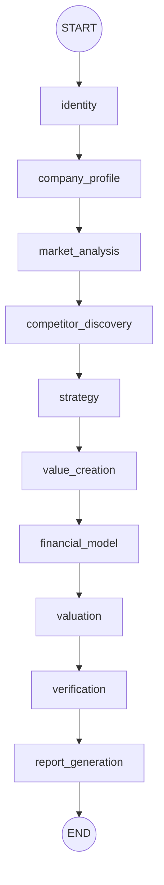

# Sequential Execution Audit

## Pipeline Overview

The Deep Research pipeline executes as a 10-node linear chain via LangGraph.
Each node runs, validates, persists results, then hands off to the next.

Defined in `backend/orchestrator/langgraph_orchestrator.py` → `PIPELINE_NODES`.

---

## Required Inputs Per Stage

| Stage | Required Inputs | Source |
|---|---|---|
| identity | company_name, orgnr, website | Initial state from API caller |
| company_profile | agent context (sources/chunks) | `repo.build_agent_context()` |
| market_analysis | agent context | `repo.build_agent_context()` |
| competitor_discovery | agent context | `repo.build_agent_context()` |
| strategy | agent context + competitor_discovery output | `node_results["competitor_discovery"]` |
| value_creation | agent context + strategy output (incl. strategy_id) | `node_results["strategy"]` |
| financial_model | agent context + strategy + value_creation + historical_financials + market_data | `node_results` + `financials_loader` |
| valuation | agent context + financial_model output (incl. financial_model_id) | `node_results["financial_model"]` |
| verification | persisted claims list for this run | `repo.list_claims_for_run()` |
| report_generation | assembled AnalysisInput + completeness report + pipeline integrity check | `AnalysisInputAssembler` + DB |

---

## Validation Gates

Each stage can have a validator registered in `backend/orchestrator/stage_validators.py` → `STAGE_VALIDATORS`.
Validators return `pass`, `warn`, or `fail`. Failed stages retry up to `MAX_STAGE_RETRIES` (2).
When `STRICT_STAGE_GATING=true`, a `fail` after retries raises `StageValidationError`.

| Stage | Validator | Fail Conditions | Warn Conditions |
|---|---|---|---|
| identity | `validate_identity` | Missing or empty orgnr; orgnr starts with `tmp-`; missing canonical_name | — |
| company_profile | `validate_company_profile` | Missing/empty business_model | Missing summary; empty products_services or geographies (if thresholds set) |
| market_analysis | `validate_market_analysis` | — | Missing market label/size; missing growth rate |
| competitor_discovery | `validate_competitors` | — | Fewer competitors than `min_competitors` threshold |
| strategy | `validate_strategy` | — | Neither investment_thesis nor acquisition_rationale present |
| value_creation | `validate_value_creation` | — | Empty initiatives list |
| financial_model | `validate_financial_model` | — | Missing assumption_set or forecast |
| valuation | `validate_valuation` | — | Neither enterprise_value nor equity_value present |
| verification | *(none)* | — | — |
| report_generation | `validate_report_quality` | Empty sections dict | Missing executive_summary or company section |

---

## Weak Handoff Points Identified

Issues discovered during sequential gating and payload audits:

1. **Financial model received no real historicals** — Before WS1, the financial_model node used synthetic defaults because `load_historical_financials()` was not called with a resolved orgnr.

2. **company_profile could pass with empty business_model** — The validator originally only warned; it now fails on missing business_model.

3. **QueryPlanner used generic queries** — Web retrieval queries were not informed by the company understanding stage, producing low-relevance results regardless of niche.

4. **Retrieval was not integrated into the pipeline** — Source ingestion happened via a separate API call, disconnected from the gated node chain.

5. **No provenance tracking** — All sources were treated as public with no distinction between proprietary, internal, and web evidence.

6. **Stage evaluations not aggregated** — The report_generation node had no way to know if upstream stages were degraded.

---

## Improvements Implemented

| Workstream | Change |
|---|---|
| WS1 — Financials loader | `backend/services/deep_research/financials_loader.py` loads 4-year actuals via real orgnr; derived metrics computed in assembler |
| WS2 — Strict validation | company_profile now fails on empty business_model; pipeline integrity check before report generation |
| WS3 — Source taxonomy | `backend/services/deep_research/source_taxonomy.py` classifies provenance; assembler tracks proprietary_source_count |
| WS4 — LLM payload contracts | `backend/llm/payload_contracts.py` defines required inputs, model selection, token limits, retry budgets, and blocked roles |
| WS5 — LLM call logging | `backend/llm/llm_call_logger.py` records run_id, stage, model, tokens, latency, cost per call |
| WS6 — Debug artifact | `backend/services/deep_research/debug_dump.py` builds a full debug artifact persisted as `analysis_input_debug` node state |
