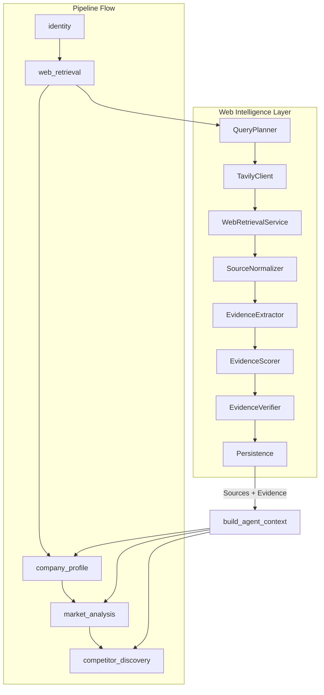

# Workstream 2: Web Intelligence

## Purpose

This document describes the web intelligence layer for the Nivo Deep Research pipeline. It centralizes Tavily usage, evidence extraction, scoring, verification, and persistence. Downstream stages (market analysis, competitor discovery) consume validated evidence via Source records.

## Architecture

## Data Flow

1. **QueryPlan** — `QueryPlanner.plan_stage_queries()` returns grouped queries (company_facts, market, competitors, news)
2. **Tavily** — Search per query; Extract on top-ranked URLs (max 10)
3. **Normalize** — Classify source type (company_site, news, database, public_authority, industry_report, marketplace, unknown)
4. **Extract** — Heuristic extraction into `EvidenceItem` with claim, claim_type, value, unit, supporting_text, confidence
5. **Score** — Relevance, authority, freshness, specificity; weighted overall_score
6. **Verify** — Cluster claims; corroborate or detect contradictions; set verification_status
7. **Persist** — web_search_sessions, web_evidence, web_evidence_rejected; create Source records for accepted evidence

## Evidence Schema

Each `EvidenceItem` includes:

| Field | Type | Description |
|-------|------|-------------|
| claim | str | The extracted claim text |
| claim_type | str | market_size, market_growth, competitor_mention, company_fact, news_development |
| value | str? | Extracted numeric value if present |
| unit | str? | Unit (msek, %, billion, etc.) |
| source_url | str | Provenance URL |
| source_title | str? | Page title |
| source_domain | str | Root domain |
| source_type | str | Classified type |
| retrieved_at | str | ISO timestamp |
| supporting_text | str | Excerpt (max 500 chars) |
| confidence | float | 0-1 specificity |
| query_group | str | company_facts, market, competitors, news |
| overall_score | float? | Weighted score |
| verification_status | str? | verified, weakly_supported, conflicting, rejected |

## Verification Statuses

- **verified** — 2+ corroborating items, no conflicts
- **weakly_supported** — Single item or uncorroborated
- **conflicting** — Same claim_type with conflicting values
- **rejected** — Below score threshold

## Config Thresholds

Defined in `DEEP_RESEARCH_THRESHOLDS`:

| Key | Default | Description |
|-----|---------|-------------|
| require_verified_market_evidence | False | Require verified market evidence |
| minimum_market_evidence_items | 1 | Min market evidence items |
| minimum_competitor_evidence_items | 1 | Min competitor evidence items |
| minimum_average_evidence_score | 0.4 | Min average score |
| require_source_diversity | True | Min unique domains |
| max_unresolved_conflicts | 2 | Max conflicts before degradation |
| max_extracted_urls_per_stage | 10 | Max URLs to extract |
| max_queries_per_stage | 6 | Max queries per run |

## Integration Points

- **Orchestrator** — `web_retrieval` runs after `identity`, before `company_profile`; company_profile and downstream stages consume Sources via build_agent_context
- **build_agent_context** — Loads Sources (including tavily_market, tavily_competitor) for downstream agents
- **Stage validators** — `validate_web_evidence_bundle` checks queries executed, accepted count
- **Recompute** — `web_retrieval` and `web_evidence` map to web_retrieval node

## Debug Artifact Fields

When `web_intel_output` is present, the debug artifact includes:

- `web_intel.executed_queries` — query, query_group, result_count
- `web_intel.evidence_accepted` — count
- `web_intel.evidence_rejected` — count
- `web_intel.metadata` — skipped, accepted_count, rejected_count, etc.

## Files

| File | Purpose |
|------|---------|
| `backend/services/web_intel/tavily_client.py` | Tavily Search + Extract wrapper |
| `backend/services/web_intel/source_normalizer.py` | Domain normalization, source type classification |
| `backend/services/web_intel/evidence_extractor.py` | Raw → EvidenceItem extraction |
| `backend/services/web_intel/evidence_scorer.py` | Relevance, authority, freshness, specificity scoring |
| `backend/services/web_intel/evidence_verifier.py` | Cluster, corroborate, detect contradictions |
| `backend/services/web_intel/web_retrieval_service.py` | Orchestration: plan, search, extract, score, verify |
| `database/migrations/026_web_intelligence.sql` | web_search_sessions, web_evidence, web_evidence_rejected |

## Constraints

- No downstream agents call Tavily directly
- Web intelligence centralized in `backend/services/web_intel/`
- All accepted claims have provenance (source_url, source_title, source_domain)
- Stages can be gated when evidence quality fails
- Bounded: max_queries_per_stage, max_extracted_urls_per_stage
