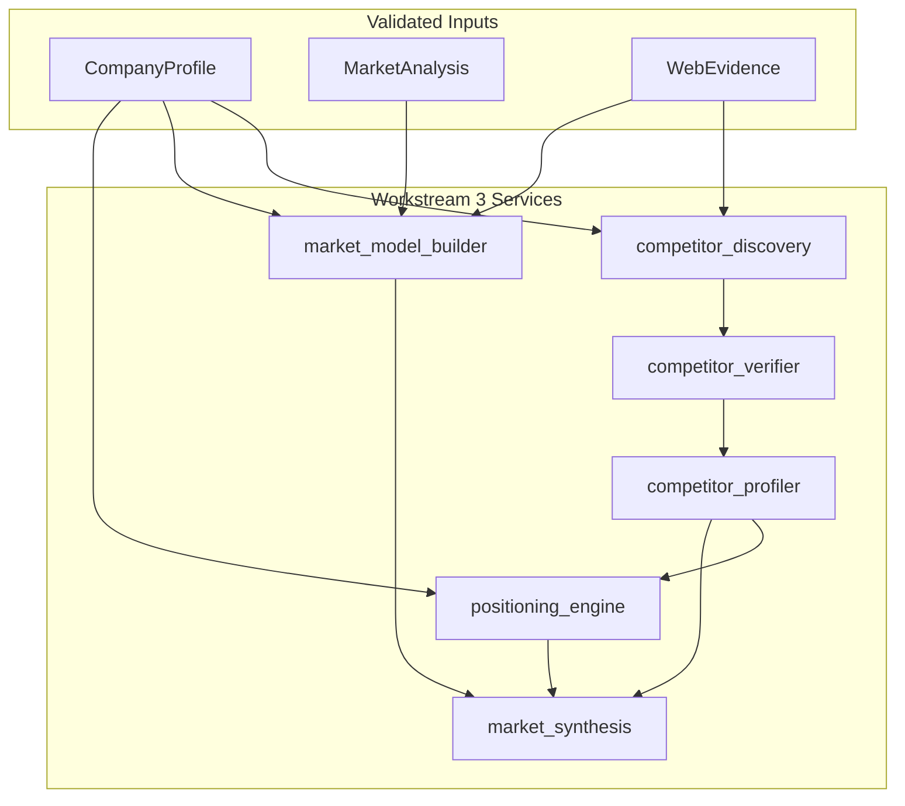

# Workstream 3: Competitor Intelligence + Market Synthesis

## Purpose

This document describes the competitor and market synthesis layer for the Nivo Deep Research pipeline. It consumes validated company understanding (Workstream 1) and validated web evidence (Workstream 2), producing canonical outputs for downstream strategy and valuation stages.

## Architecture

## Data Flow

1. **Inputs**: Company profile (market_niche, products_services, geographies), market analysis, validated WebEvidence
2. **Discovery** — Extract competitor candidates from evidence (competitor_mention claims, source domains)
3. **Verification** — Score overlap on offering, customer, geography; reject co-occurrence-only
4. **Profiling** — Build canonical profiles for accepted competitors
5. **Market model** — Structured model from evidence + company/market context
6. **Positioning** — Compare target vs competitors on axes; mark unclear when evidence insufficient
7. **Synthesis** — Aggregate scores, key claims, uncertainties

## Services

| File | Purpose |
|------|---------|
| `backend/services/deep_research/competitor_discovery.py` | Generate candidate universe (direct, adjacent, substitute) with rationale and evidence refs |
| `backend/services/deep_research/competitor_verifier.py` | Verify by overlap; classify verified_direct, verified_adjacent, substitute, weak_candidate, rejected |
| `backend/services/deep_research/competitor_profiler.py` | Build canonical profiles (description, product_focus, scale_signal, confidence) |
| `backend/services/deep_research/market_model_builder.py` | Structured market model (demand_drivers, growth, concentration, fragmentation, etc.) |
| `backend/services/deep_research/positioning_engine.py` | Differentiated, parity, disadvantage, unclear axes |
| `backend/services/deep_research/market_synthesis.py` | Market attractiveness, competition intensity, niche defensibility, growth support, uncertainties |
| `backend/services/deep_research/evidence_loader.py` | Load validated WebEvidence for a run |

## Schemas

Defined in `backend/services/deep_research/competitor_market_schemas.py`:

- **CompetitorCandidateW3** — name, candidate_type, inclusion_rationale, evidence_refs
- **VerifiedCompetitor** — verification_status, rejection_reason, overlap_scores
- **CompetitorProfileW3** — company_name, description, product_focus, profile_confidence
- **MarketModel** — market_label, demand_drivers, growth/concentration/fragmentation signals
- **PositioningAnalysis** — differentiated_axes, parity_axes, disadvantage_axes, unclear_axes
- **MarketSynthesis** — scores, key_supporting_claims, key_uncertainties, confidence_score

## Persistence

Migration `027_competitor_market_synthesis.sql` adds:

- **competitor_candidates** — candidates with verification_status, rejection_reason
- **market_models** — run_id, company_id, market_label, demand_drivers, signals
- **positioning_analyses** — differentiated/parity/disadvantage/unclear axes
- **market_syntheses** — scores, summary, claims, uncertainties

## Config Thresholds

In `DEEP_RESEARCH_THRESHOLDS`:

| Key | Default | Description |
|-----|---------|-------------|
| minimum_verified_competitors | 1 | Min accepted (non-rejected) competitors |
| minimum_direct_competitors | 0 | Min verified_direct (0 = not required) |
| minimum_competitor_profile_confidence | 0.4 | Min profile confidence |
| minimum_market_model_confidence | 0.4 | Min market model confidence |
| maximum_unclear_positioning_ratio | 0.7 | Fail if unclear axes ratio exceeds this |
| minimum_market_synthesis_confidence | 0.4 | Min synthesis confidence |

## Stage Validators

`validate_competitors` (for competitor_discovery node) checks:

- Verified competitor count
- Direct competitor presence (when threshold > 0)
- Market model completeness (market_label, confidence)
- Positioning clarity (unclear ratio)
- Market synthesis confidence and supporting evidence

## Debug Artifact

When `competitor_market_synthesis_output` is present, the debug artifact includes:

- `generated_candidates` — count, by_type (direct/adjacent/substitute)
- `acceptance_rejection_reasons` — by verification_status
- `competitor_categories` — verified_direct, verified_adjacent, etc.
- `market_model_completeness` — fields populated, confidence
- `positioning_ambiguity` — unclear_axes count, ratio
- `synthesis_score_breakdown` — all scores

## Integration

- **Orchestrator** — `competitor_discovery` node runs Workstream 3 pipeline; outputs passed to strategy
- **Strategy agent** — Receives `competitors` payload (backward compat) from node output
- **Analysis input assembler** — Loads market_model, positioning_analysis, market_synthesis from DB
- **Report** — Can consume ai.market_model, ai.positioning_analysis, ai.market_synthesis

## Constraints

- Consume only validated evidence (WebEvidence); no raw search snippets
- Every accepted competitor must have evidence-backed overlap rationale
- Explicitly preserve uncertainty (unclear_axes) instead of fabricating differentiation
- Outputs are canonical and reusable by strategy and valuation stages
